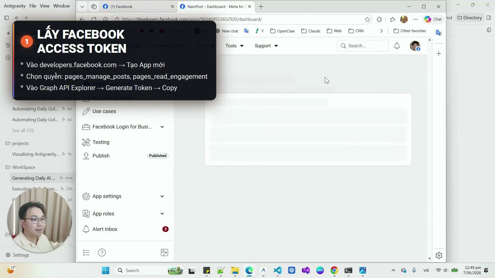
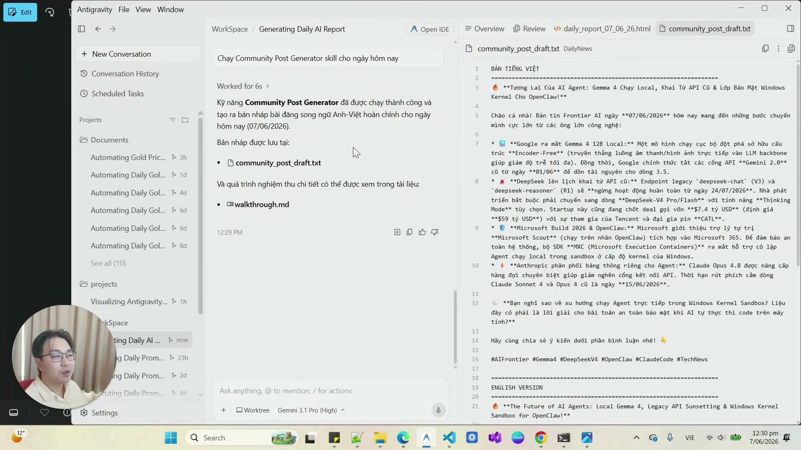

# Bài 3.10: Vận Hành Tự Động Không Giám Sát Với Scheduled Tasks — Hẹn Giờ Tự Động Cào Tin & Bắn API

> 🚀 **Mã thực hành:** `/start-3-10`  
> 🎯 **Mục tiêu:** Làm chủ công cụ `schedule` của Antigravity để thiết lập các tác vụ tự động thức dậy theo lịch hẹn định kỳ (Cron Jobs), tự động cào tin tức thị trường, viết bài truyền thông và gửi báo cáo mỗi sáng hoàn toàn không cần con người bấm nút giám sát.

---

## 💡 Từ "Trợ Lý Đợi Lệnh" Đến "Hệ Thống Tự Động Hóa 24/7"

Hầu hết người dùng chỉ sử dụng AI theo kiểu **Tương tác trực tiếp (Synchronous Interaction)**: Người dùng ngồi trước máy tính, gõ prompt, chờ AI trả lời rồi copy kết quả.

**Với Scheduled Tasks trong Antigravity, bạn nâng cấp lên Vận hành không giám sát (Autonomous Unattended Operations):**
* Bạn đi ngủ lúc 23:00.
* Đúng 06:30 sáng hôm sau, hệ thống Antigravity tự động thức dậy:
  1. Quét qua 5 trang tin tức công nghệ lớn.
  2. Lọc ra 3 xu hướng nổi bật nhất trong đêm.
  3. Soạn thảo một bản tin tóm tắt buổi sáng (Morning Briefing).
  4. Gọi Webhook/API bắn thẳng vào nhóm Telegram/Zalo hoặc Fanpage công ty.
* Khi bạn thức dậy uống cà phê lúc 07:00, mọi công việc đã hoàn thành mỹ mãn!


*Hình 3.10.1: Antigravity tự động thực thi nhiệm vụ theo lịch định sẵn ở chế độ nền.*

---

## ⏱️ 2 Chế Độ Hẹn Giờ Cốt Lõi: Timer vs Cron

Trong Antigravity, bạn có 2 cơ chế lên lịch tùy theo tính chất công việc:

| Loại Lịch Hẹn | Cấu Hình Tham Số | Khi Nào Sử Dụng? | Ví Dụ Thực Tế |
| :--- | :--- | :--- | :--- |
| **One-shot Timer (Nhắc 1 lần)** | `DurationSeconds: 1800` | Cần AI kiểm tra hoặc nhắc nhở bạn sau một khoảng thời gian nhất định | *"Sau 30 phút nữa hãy nhắc tôi vào kiểm tra tiến độ dự án của phòng Kinh doanh."* |
| **Recurring Cron (Định kỳ lặp lại)** | `CronExpression: "0 7 * * *"` | Các tác vụ lặp đi lặp lại hàng ngày, hàng tuần hoặc hàng tháng | *"Mỗi 07:00 sáng từ Thứ 2 đến Thứ 6, tự động cào tin tức và soạn bài đăng."* |

### Cờ quan trọng `IsDaemon`:
* `IsDaemon: false` (Mặc định): Lịch hẹn gắn liền với phiên làm việc hiện tại, tự hủy khi bạn đóng task.
* `IsDaemon: true`: Lịch hẹn biến thành một dịch vụ chạy ngầm độc lập vĩnh viễn (Standing Daemon Job), tiếp tục hoạt động đều đặn kể cả khi bạn đã đóng cuộc trò chuyện!


*Hình 3.10.2: Tự động hóa chuỗi quy trình: Thu thập tin tức ──► Soạn bài ──► Đăng tải.*

---

## 📋 Mẫu Thiết Lập Lịch Hẹn Tự Động Hóa (Automation Recipe)

```markdown
/schedule
Thiết lập một tác vụ định kỳ tự động chạy vào lúc 07:00 sáng mỗi ngày:
- Cron: "0 7 * * 1-5" (Thứ 2 đến Thứ 6 hàng tuần)
- IsDaemon: true
- Nhiệm vụ:
  1. Quét tin tức thị trường phần mềm quản lý tại Việt Nam trong 24 giờ qua.
  2. Viết bản tóm tắt 3 tin đáng chú ý nhất với phong cách súc tích.
  3. Gửi thông báo kết quả vào kênh tiếp nhận nội bộ.
```

---

## 🎯 Bài Tập Thực Hành (Hands-on Challenge)

1. Mở Antigravity và gõ `/start-3-10`.
2. Thiết lập một Timer hẹn giờ 60 giây để nhắc nhở hoàn thành bài tập cuối khóa.
3. Quan sát thông báo tự động thức dậy từ hệ thống và xem nhật ký ghi nhận tiến trình trong lịch trình tác vụ ngầm.
