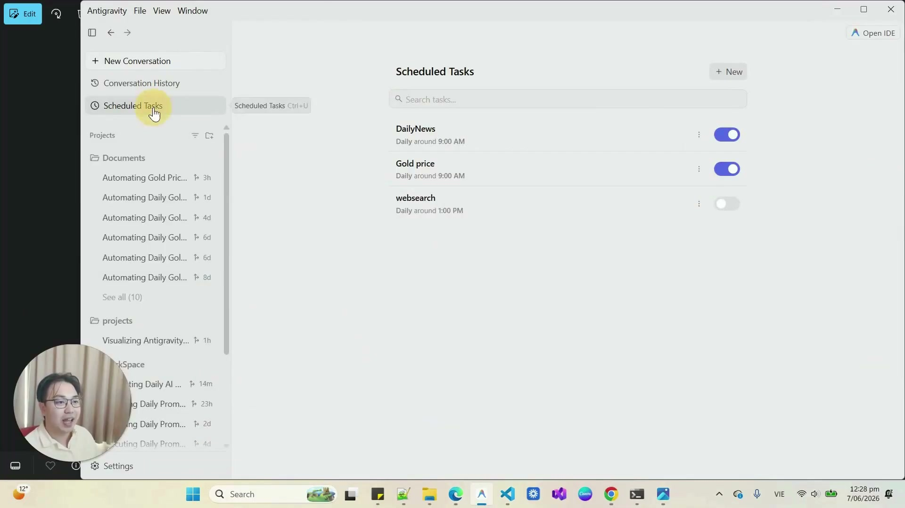
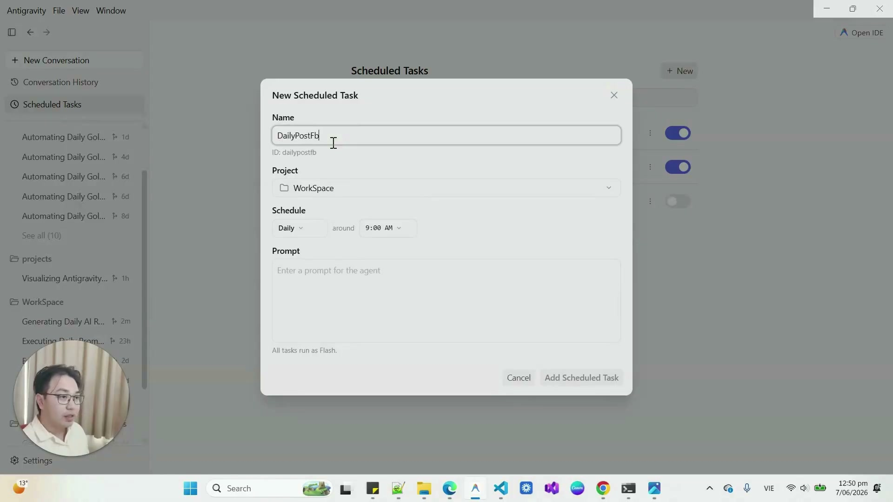
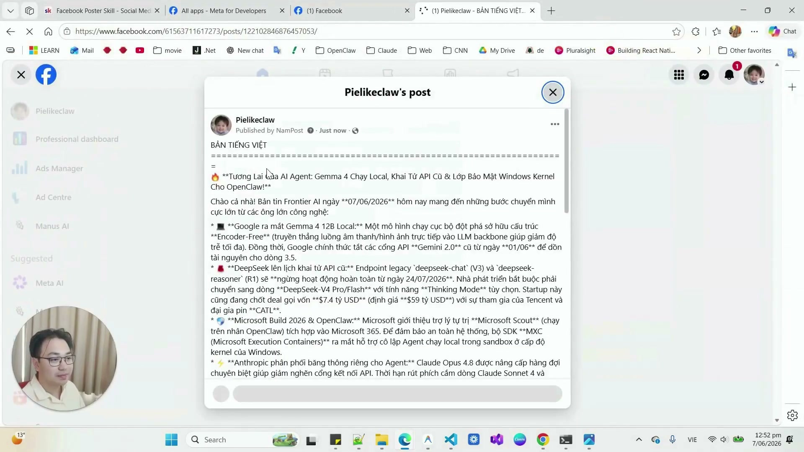

# Bài 3.10: Vận hành tự động theo lịch với Scheduled Tasks — Hẹn giờ định kỳ và gửi thông báo

> 🚀 **Mã thực hành:** `/start-3-10`  
> 🎯 **Mục tiêu:** Làm chủ công cụ `schedule` của Antigravity để thiết lập các tác vụ tự động theo lịch hẹn định kỳ (Cron Jobs), tự động quét tin tức thị trường, viết bài truyền thông hoặc gửi báo cáo tổng kết định kỳ.

---

## 💡 Chuyển đổi từ tương tác thủ công sang tác vụ định kỳ tự động

Phần lớn người dùng mới làm quen với AI theo kiểu **Tương tác trực tiếp (Synchronous Interaction)**: Ngồi trước máy tính, gõ prompt, chờ AI trả lời rồi copy kết quả.

**Với Scheduled Tasks trong Antigravity, bạn có thể thiết lập các quy trình tự động theo lịch (Scheduled Operations):**
* Bạn lên lịch trước vào cuối ngày.
* Đúng 06:30 sáng hôm sau, hệ thống Antigravity tự động kích hoạt tác vụ:
  1. Quét thông tin từ các nguồn tin tức đã chỉ định.
  2. Lọc ra các điểm tin đáng chú ý.
  3. Soạn thảo bản tin tóm tắt buổi sáng (Morning Briefing).
  4. Gửi thông báo kết quả vào kênh tiếp nhận nội bộ hoặc lưu thành file báo cáo sẵn sàng.
* Khi bạn bắt đầu ngày làm việc lúc 07:00, tài liệu đã được chuẩn bị sẵn để bạn kiểm tra và duyệt lại.


*Hình 3.10.1: Giao diện Scheduled Tasks (Ctrl+U) trong Antigravity 2.0 quản lý các tác vụ tự động chạy ngầm hàng ngày.*

---

## ⏱️ Hai chế độ hẹn giờ cốt lõi: Timer và Cron

Trong Antigravity, bạn có 2 cơ chế lên lịch tùy theo tính chất công việc:

| Loại lịch hẹn | Cấu hình tham số | Khi nào sử dụng? | Ví dụ thực tế |
| :--- | :--- | :--- | :--- |
| **One-shot Timer (Nhắc 1 lần)** | `DurationSeconds: 1800` | Cần AI kiểm tra hoặc nhắc nhở sau một khoảng thời gian nhất định | *"Sau 30 phút nữa hãy nhắc tôi vào kiểm tra tiến độ dự án của phòng Kinh doanh."* |
| **Recurring Cron (Định kỳ lặp lại)** | `CronExpression: "0 7 * * *"` | Các tác vụ lặp đi lặp lại hàng ngày, hàng tuần hoặc hàng tháng | *"Mỗi 07:00 sáng từ Thứ 2 đến Thứ 6, tự động quét tin tức và soạn bản tin tóm tắt."* |

### Cờ quan trọng `IsDaemon`:
* `IsDaemon: false` (Mặc định): Lịch hẹn gắn liền với phiên làm việc hiện tại, tự hủy khi bạn đóng task.
* `IsDaemon: true`: Lịch hẹn hoạt động độc lập như một tiến trình ngầm (Daemon Job), tiếp tục duy trì theo chu kỳ đã hẹn kể cả khi bạn đã đóng cuộc trò chuyện.


*Hình 3.10.2: Thiết lập tác vụ New Scheduled Task tự động kích hoạt vào lúc 9:00 AM mỗi ngày.*


*Hình 3.10.3: Kết quả thực tế: Bài viết được AI tự động tổng hợp thông tin, viết bài và xuất bản lên Fanpage theo lịch trình định sẵn.*

---

## 📋 Mẫu thiết lập lịch hẹn tự động (Scheduled Recipe)

```markdown
/schedule
Thiết lập một tác vụ định kỳ tự động chạy vào lúc 07:00 sáng mỗi ngày:
- Cron: "0 7 * * 1-5" (Thứ 2 đến Thứ 6 hàng tuần)
- IsDaemon: true
- Nhiệm vụ:
  1. Quét tin tức thị trường phần mềm quản lý tại Việt Nam trong 24 giờ qua.
  2. Viết bản tóm tắt 3 tin đáng chú ý nhất với phong cách súc tích.
  3. Gửi thông báo kết quả vào kênh tiếp nhận nội bộ.
```

---

## 🎯 Bài tập thực hành (Hands-on Challenge)

1. Mở Antigravity và gõ `/start-3-10`.
2. Thiết lập một Timer hẹn giờ 60 giây để nhắc nhở hoàn thành bài tập cuối khóa.
3. Quan sát thông báo tự động thức dậy từ hệ thống và xem nhật ký ghi nhận tiến trình trong lịch trình tác vụ ngầm.
