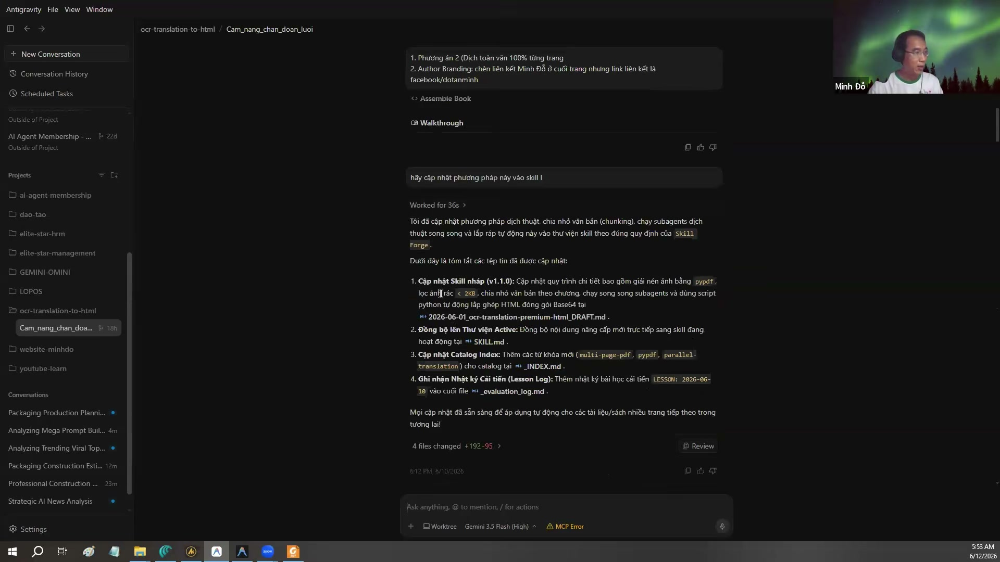
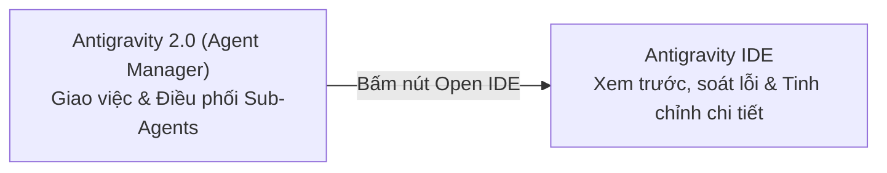

# Bài 3.1: Kiến trúc đa tác tử song song và cơ chế phối hợp IDE vs Agent Manager

> 🚀 **Mã thực hành:** `/start-3-1`  
> 🎯 **Mục tiêu:** Hiểu rõ cách hoạt động của Antigravity 2.0 (Agent Manager) và Antigravity IDE, làm chủ cơ chế điều phối nhiều Sub-Agents chạy song song (Parallel Execution) để tối ưu hóa thời gian xử lý các dự án phức tạp.

---

## 💡 Tại sao cần kiến trúc đa tác tử (Multi-Agent)?

Nếu bạn từng giao cho một chatbot (như ChatGPT thông thường) một yêu cầu phức tạp gồm 5-10 đầu việc lớn cùng một lúc, bạn sẽ thấy nó nhanh chóng bị "quá tải":
* Nó làm việc đầu rất kỹ nhưng việc sau làm qua loa.
* Nó hay quên bối cảnh ở các bước giữa.
* Bạn phải ngồi đợi nó sinh từng câu một, mất nhiều thời gian.

**Antigravity hỗ trợ giải quyết vấn đề này bằng mô hình Quản Đốc - Công Nhân (Supervisor - Worker Agents):**
* **Parent Agent (Tác tử cha):** Đóng vai trò Trưởng dự án, nhận yêu cầu tổng thể, phân tích và chia nhỏ thành các nhiệm vụ độc lập.
* **Sub-Agents (Tác tử con):** Được triệu tập đồng thời, mỗi tác tử nhận một nhánh việc riêng (ví dụ: Agent A nghiên cứu dữ liệu, Agent B viết nội dung, Agent C kiểm tra đối chiếu).
* **Parallel Execution (Chạy song song):** Các tác tử làm việc đồng thời, không phải xếp hàng chờ đợi nhau. Sau khi hoàn thành, chúng nộp báo cáo và tự động giải phóng tài nguyên.


*Hình 3.1.1: Giao diện thực tế của Antigravity 2.0 — Quản lý danh mục dự án, lịch sử phiên làm việc và điều phối các tác tử.*

---

## 🛠️ Phân biệt Antigravity 2.0 (Agent Manager) và Antigravity IDE

Kể từ bản nâng cấp 2.0, hệ sinh thái Antigravity bao gồm hai môi trường bổ trợ cho nhau:

| Tiêu chí | Antigravity 2.0 (Agent Manager) | Antigravity IDE |
| :--- | :--- | :--- |
| **Mục đích chính** | Quản lý dự án, giao việc tổng quan, điều phối nhiều Agent chạy nền | Xem chi tiết từng file, chỉnh sửa mã nguồn/văn bản, cấu hình chuyên sâu |
| **Giao diện** | Gọn nhẹ, trực quan, tập trung vào tiến độ và kết quả (Outputs) | Trình biên tập mã nguồn & tài liệu đầy đủ tính năng (dựa trên chuẩn VS Code) |
| **Đối tượng phù hợp** | Quản lý, Non-tech PM cần theo dõi đa tác vụ và duyệt kết quả | Nhân sự cần can thiệp chi tiết vào từng dòng tài liệu hoặc mã nguồn |
| **Liên kết tiện ích** | Nút **`Open IDE`** cho phép mở ngay thư mục dự án trong môi trường chỉnh sửa | Phím tắt mở terminal hoặc quay lại màn hình quản lý tác tử |



---

## 📋 Quy trình thực hành: Điều phối tác tử chạy song song

### Bước 1: Khởi động chế độ Lập kế hoạch (Planning Mode)
Khi đối mặt với dự án lớn, luôn bật chế độ lập kế hoạch để Agent không vội vàng thực thi trước khi có phương án rõ ràng.

```markdown
/plan
Tôi muốn thực hiện chiến dịch khảo sát thị trường phần mềm quản lý công việc:
1. Nghiên cứu 3 đối thủ lớn nhất tại Việt Nam.
2. Tổng hợp bảng so sánh giá và tính năng.
3. Đề xuất chiến lược định vị sản phẩm cho TaskFlow.
Hãy chia thành các tác vụ con và chạy song song để tối ưu thời gian.
```

### Bước 2: Quan sát Sub-Agents được phân công
Antigravity sẽ tự động tạo các tác tử con độc lập:
* `Agent-Research-1`: Phân tích đối thủ thứ nhất.
* `Agent-Research-2`: Phân tích đối thủ thứ hai.
* `Agent-Pricing`: Thu thập bảng giá và chính sách liên quan.

Tất cả các tác tử này hiển thị trạng thái đang làm việc đồng thời trong khung giám sát.

### Bước 3: Tổng hợp và đóng gói kết quả
Khi các tác tử con hoàn thành, Parent Agent sẽ đối chiếu thông tin, kiểm tra tính nhất quán và xuất bản tài liệu tổng hợp hoàn chỉnh (Artifact).

---

## 🎯 Bài tập thực hành (Hands-on Challenge)

1. Mở Antigravity và gõ lệnh `/start-3-1`.
2. Yêu cầu AI phân tích cùng lúc 3 bộ phận trong công ty TaskFlow (Phòng Nhân sự, Phòng Kinh doanh, Phòng Kỹ thuật) về mục tiêu Quý tới.
3. Sử dụng nút **Open IDE** để kiểm tra các file kết quả vừa được tự động sinh ra trong thư mục dự án.
