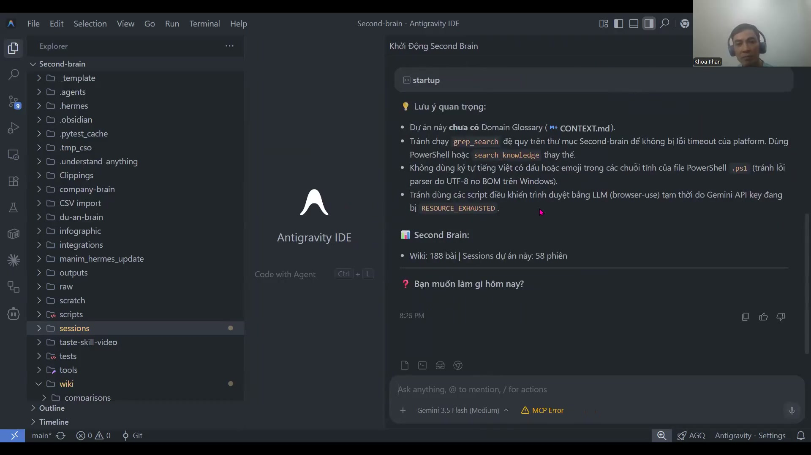
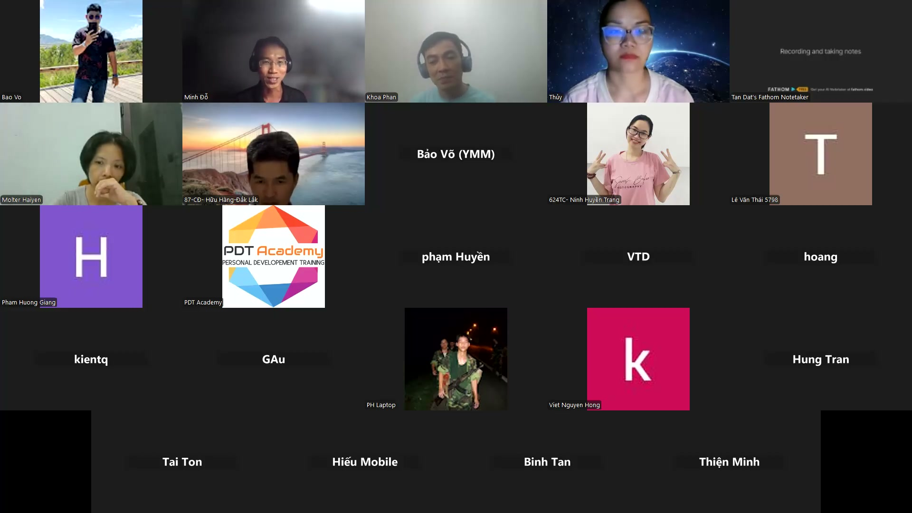

# Bài 3.2: Thiết Lập Bộ Não Thứ Hai (Second Brain) Chuẩn Local-First

> 🚀 **Mã thực hành:** `/start-3-2`  
> 🎯 **Mục tiêu:** Thiết lập hệ thống lưu trữ tri thức doanh nghiệp theo nguyên tắc "Local-First" trên ổ cứng cá nhân. Dữ liệu tuyệt đối bảo mật, không rò rỉ ra bên thứ 3 và có thể tra cứu ngữ nghĩa tức thì bằng AI.

---

## 💡 Triết Lý "Local-First" Là Gì? Tại Sao Doanh Nghiệp Cần?

Hầu hết mọi người hiện nay lưu trữ ghi chú trên các nền tảng đám mây (Notion, Google Docs, Confluence). Tuy nhiên, khi kết hợp với AI, lưu trữ đám mây bộc lộ 3 rủi ro lớn:
1. **Nguy cơ rò rỉ dữ liệu nhạy cảm:** Báo cáo tài chính, hợp đồng, danh sách lương nhân sự không thể tùy tiện upload lên cloud công cộng.
2. **Khóa chặt nhà cung cấp (Vendor Lock-in):** Khi nền tảng tăng giá hoặc đổi chính sách, bạn khó di chuyển toàn bộ dữ liệu ra ngoài.
3. **Tốc độ & Tính độc lập:** Mất mạng là mất quyền truy cập; độ trễ mạng làm giảm hiệu suất xử lý của AI.

**Triết lý "Local-First" giải quyết bài toán này:** Toàn bộ ghi chú, tài liệu đều là các tệp văn bản thuần túy (Markdown `.md`) lưu trực tiếp trên ổ cứng máy tính cá nhân của bạn. AI chỉ đọc và phân tích cục bộ (Local Context).


*Hình 3.2.1: Toàn bộ tri thức nằm trọn trong máy tính cá nhân, an toàn tuyệt đối.*

---

## 📂 Cấu Trúc Cây Thư Mục Second Brain Chuẩn 4 Tầng (P.A.R.A)

Để AI Agent có thể tìm kiếm và tái sử dụng tri thức nhanh nhất, chúng ta áp dụng cấu trúc thư mục 4 tầng chuẩn quốc tế:

```
📁 My_Second_Brain/
├── 📥 _INBOX/            <-- Nơi hứng mọi tài liệu thô, ghi chú nhanh, file vừa tải về
├── 🚀 01_PROJECTS/       <-- Các dự án đang chạy có thời hạn và mục tiêu cụ thể (VD: Chien_Dich_Q3/)
├── 🏢 02_AREAS/          <-- Các mảng trách nhiệm duy trì liên tục (VD: Nhan_Su/, Tai_Chinh/, Marketing/)
├── 📚 03_RESOURCES/      <-- Kho tư liệu tham khảo, tài liệu học tập, biểu mẫu quy chuẩn
└── 📦 04_ARCHIVE/        <-- Các dự án đã hoàn thành, cất đi để không làm rối mắt AI
```


*Hình 3.2.2: Cấu trúc thư mục ngăn nắp giúp AI định vị ngữ cảnh trong 1 giây.*

---

## 🔍 Kỹ Thuật Tra Cứu Ngữ Nghĩa Siêu Tốc (Semantic Search)

Thay vì bạn phải mở từng thư mục và đọc từng file, bạn biến Antigravity thành một **Công cụ Tìm kiếm Thông minh Nội bộ**:

### 1. Dùng lệnh tra cứu ngữ cảnh bằng phím `@`
Gõ `@` kèm tên thư mục hoặc tên chủ đề, Antigravity sẽ đọc lướt hàng chục file markdown liên quan để trả lời:
* *"@02_AREAS/Nhan_Su Chính sách nghỉ phép năm của công ty quy định thế nào?"*
* *"@01_PROJECTS So sánh ngân sách thực tế so với dự toán ban đầu."*

### 2. Tìm kiếm đối chiếu chéo (Cross-referencing)
Agent có thể tổng hợp kiến thức từ nhiều dự án cũ trong `04_ARCHIVE/` để đưa ra giải pháp cho một bài toán mới trong `01_PROJECTS/`.

---

## 🎯 Bài Tập Thực Hành (Hands-on Challenge)

1. Mở Antigravity và gõ `/start-3-2`.
2. Yêu cầu AI quét thư mục mẫu `TaskFlow_Context/` và sắp xếp các tài liệu vào đúng 4 tầng thư mục chuẩn.
3. Ra lệnh cho AI: *"Dựa vào toàn bộ tài liệu trong Second Brain, hãy lập một bản tóm tắt 5 nguyên tắc ứng xử văn hóa của TaskFlow."*
