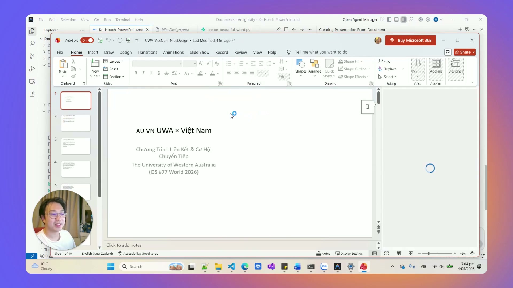
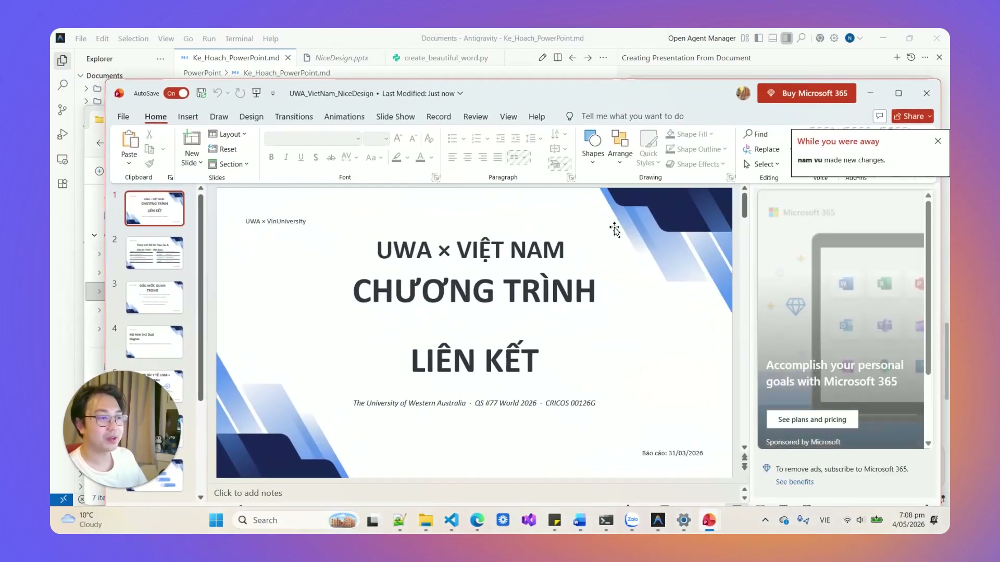
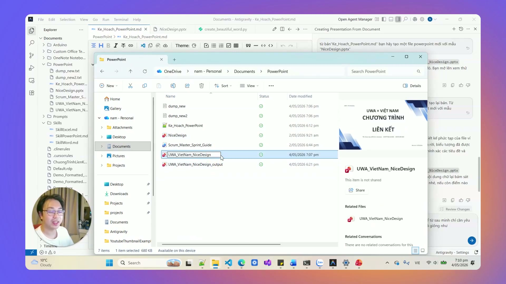

# Bài 3.5: Tự động hóa slide thuyết trình theo nhận diện thương hiệu với Slide Master

> 🚀 **Mã thực hành:** `/start-3-5`  
> 🎯 **Mục tiêu:** Hiểu rõ giới hạn của việc để AI tự tạo slide từ con số không, làm chủ kỹ thuật tận dụng tệp Slide Master (.pptx) của công ty kết hợp với AI, tự động chèn nội dung vào đúng khung định sẵn mà không tốn công căn chỉnh lại bố cục.

---

## 💡 Giới hạn của việc để AI tự tạo slide từ câu lệnh thô

Khi bạn yêu cầu AI: *"Hãy tạo cho tôi 10 slide PowerPoint từ file văn bản này"*, thông thường AI sẽ dùng các đoạn mã thô để vẽ từng ô chữ (textbox). Kết quả thực tế thường gặp các lỗi sau:
* Chữ bị tràn ra ngoài viền màn hình (overflow text).
* Font chữ không đồng bộ với nhận diện thương hiệu của công ty.
* Thiếu bố cục màu sắc nhất quán, logo bị lệch hoặc biến mất.
* Tốn nhiều lượt prompt và token chỉ để căn chỉnh tọa độ x, y từng pixel.


*Hình 3.5.1: Slide do AI tự tạo thô sơ không có mẫu (tại 02:08 của video gốc) chỉ có chữ thô, không có layout.*

---

## 🛠️ Giải pháp: Đóng gói mẫu Slide Master doanh nghiệp kết hợp AI

Thay vì để AI tự phán đoán giao diện mỗi lần thuyết trình, phương pháp tối ưu là: **Chuẩn bị trước 1 file Template PowerPoint có sẵn Slide Master chuẩn mực.**


*Hình 3.5.2: Kết quả thực tế (tại 03:50 của video gốc) khi nạp mẫu Slide Master: slide đồng bộ, giữ trọn nhận diện thương hiệu.*

### Cơ chế hoạt động của Slide Master kết hợp AI:
1. **File mẫu (`template.pptx`):** Đã được phòng thiết kế/truyền thông cài sẵn:
   - Layout 0: Slide Bìa (Tiêu đề lớn, Tên người trình bày, Logo góc trên).
   - Layout 1: Slide Nội dung 1 cột (Tiêu đề mục, Gạch đầu dòng tóm tắt).
   - Layout 2: Slide So sánh 2 cột (Ưu điểm vs Nhược điểm, Trước vs Sau).
   - Layout 3: Slide Kết luận & Kêu gọi hành động (Call to Action).
2. **AI tập trung vào thế mạnh nội dung:** Đọc tài liệu của bạn, chắt lọc ý chính, và **điền nội dung vào đúng các Placeholder đã định danh sẵn**.
3. **Kết quả:** Slide xuất ra ngay ngắn, đúng quy chuẩn thiết kế, giữ nguyên màu sắc thương hiệu và logo công ty.


*Hình 3.5.3: Đóng gói quy trình thành Skill (tại 05:30 của video gốc), lần sau chỉ cần nạp tên tài liệu là tự động tạo slide theo mẫu.*

---

## 📋 Mẫu câu lệnh tạo bài thuyết trình theo mẫu có sẵn

```markdown
@Ke_Hoach_Kinh_Doanh_Q3.docx @mau_slide_cong_ty.pptx
Hãy đóng vai trò chuyên viên biên tập nội dung thuyết trình:
1. Đọc nội dung kế hoạch kinh doanh Q3 trong file docx.
2. Tóm tắt cô đọng thành cấu trúc 8 slide thuyết trình.
3. Mở file template mau_slide_cong_ty.pptx:
   - Slide 1: Dùng Layout 0 (Title Slide).
   - Slide 2-6: Dùng Layout 1 và Layout 2 để trình bày mục tiêu và chỉ số KPI.
   - Slide 7-8: Dùng Layout 3 cho phần lộ trình triển khai và Q&A.
4. Mỗi gạch đầu dòng không quá 12 từ để đảm bảo người xem dễ đọc trên màn hình lớn.
5. Xuất ra tệp hoàn chỉnh: Thuyet_Trinh_Ke_Hoach_Q3_HoanThien.pptx.
```

---

## 🎯 Bài tập thực hành (Hands-on Challenge)

1. Mở Antigravity và gõ `/start-3-5`.
2. Lấy file mẫu `TaskFlow_SlideMaster_Template.pptx` có sẵn trong thư mục khóa học.
3. Chuyển hóa bản tóm tắt dự án của bạn thành một bộ slide 6 trang hoàn chỉnh và kiểm tra độ vừa vặn của chữ trong từng khung nội dung.
