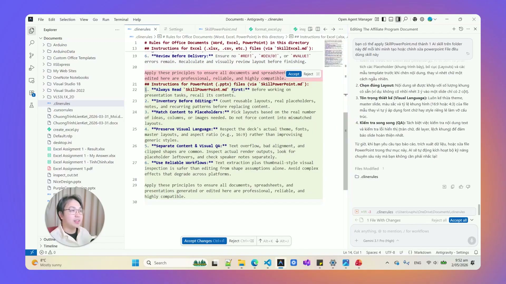
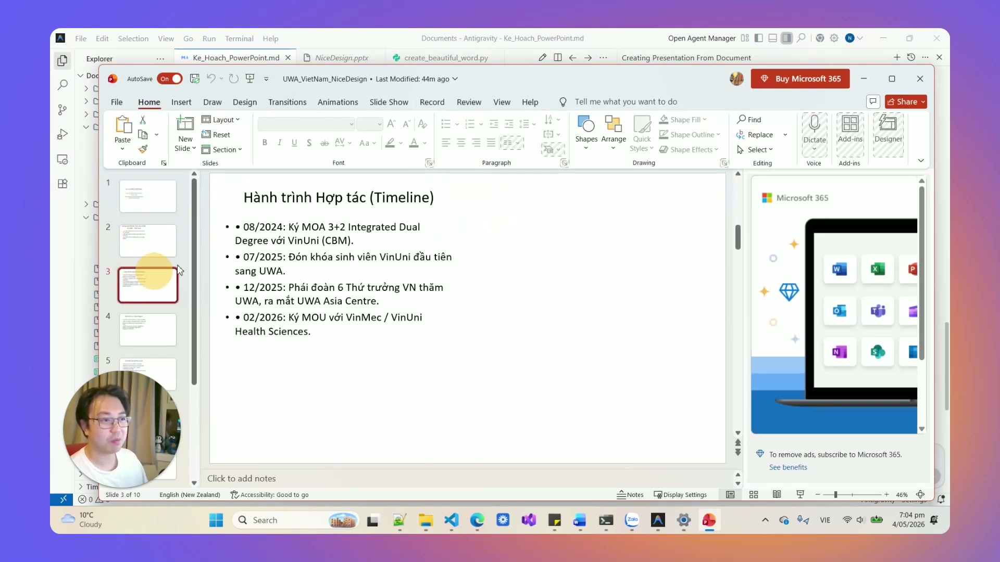
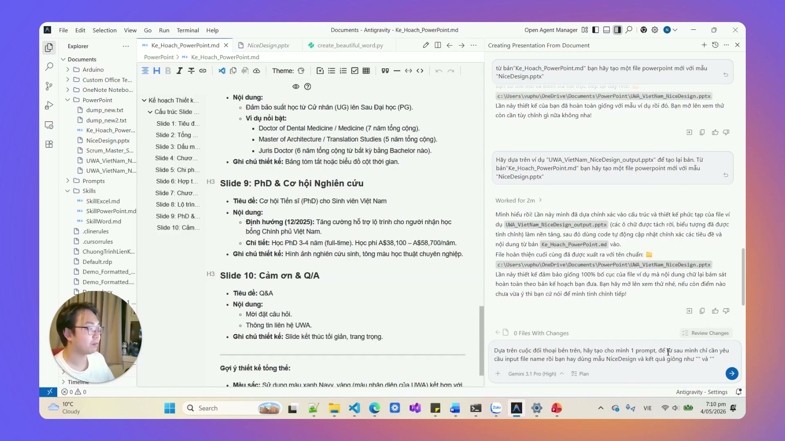

# Bài 3.5: Tự Động Hóa Slide Thuyết Trình Chuẩn Nhận Diện Thương Hiệu Với Slide Master

> 🚀 **Mã thực hành:** `/start-3-5`  
> 🎯 **Mục tiêu:** Hiểu rõ giới hạn của việc để AI tự tạo slide từ con số không, làm chủ kỹ thuật đóng gói tệp Slide Master (.pptx) của công ty thành Skill dùng trọn đời, tự động chèn nội dung vào đúng placeholder mà không mất một đồng chi phí token vẽ lại layout.

---

## 💡 Giới Hạn Của Việc Để AI Tự Tạo Slide Bằng Lệnh Thông Thường

Khi bạn yêu cầu AI: *"Hãy tạo cho tôi 10 slide PowerPoint từ file văn bản này"*, thông thường AI sẽ dùng các thư viện mã nguồn thô để vẽ ra từng ô chữ (textbox). Kết quả thực tế thường rất thất vọng:
* Chữ bị tràn ra ngoài viền màn hình (overflow text).
* Font chữ nhảy lung tung, không khớp với nhận diện thương hiệu công ty (Brand Guidelines).
* Không có bố cục màu sắc, logo công ty bị lệch hoặc biến mất.
* Mỗi lần chạy lại tốn hàng nghìn token chỉ để AI loay hoay căn chỉnh tọa độ x, y từng pixel!


*Hình 3.5.1: Slide do AI tự tạo thô sơ thường bị tràn chữ và thiếu chuyên nghiệp.*

---

## 🏆 Kỹ Thuật Đỉnh Cao: Đóng Gói Slide Master Doanh Nghiệp Thành Skill

Thay vì để AI "mò mẫm" vẽ lại giao diện mỗi lần thuyết trình, phương pháp của các chuyên gia tự động hóa là: **Chuẩn bị trước 1 file Template PowerPoint có sẵn Slide Master chuyên nghiệp!**


*Hình 3.5.2: Tái sử dụng mẫu Slide Master sẵn có giúp slide đẹp chuẩn 100% không tốn token.*

### Cơ chế hoạt động của Slide Master Skill:
1. **File mẫu (`template.pptx`):** Đã được phòng thiết kế/marketing cài sẵn:
   - Layout 0: Slide Bìa (Tiêu đề lớn, Tên người trình bày, Logo góc trên).
   - Layout 1: Slide Nội dung 1 cột (Tiêu đề mục, Gạch đầu dòng tóm tắt).
   - Layout 2: Slide So sánh 2 cột (Ưu điểm vs Nhược điểm, Trước vs Sau).
   - Layout 3: Slide Kết luận & Kêu gọi hành động (Call to Action).
2. **AI chỉ làm đúng 1 việc nó giỏi nhất:** Đọc tài liệu của bạn, chắt lọc ý chính, và **"bắn" text vào đúng các Placeholder đã định danh sẵn**.
3. **Kết quả:** Slide xuất ra lập tức đẹp như do Designer chuyên nghiệp thiết kế, giữ nguyên màu sắc thương hiệu và logo công ty!


*Hình 3.5.3: Quy trình tự động biến văn bản thô thành bộ slide doanh nghiệp chỉ sau 30 giây.*

---

## 📋 Mẫu Prompt Kích Hoạt Tạo Slide Master Chuẩn Xác

```markdown
@Ke_Hoach_Kinh_Doanh_Q3.docx @mau_slide_cong_ty.pptx
Hãy đóng vai trò Giám đốc Truyền thông & Thuyết trình chuyên nghiệp:
1. Đọc nội dung kế hoạch kinh doanh Q3 trong file docx.
2. Tóm tắt cô đọng thành cấu trúc 8 slide thuyết trình.
3. Mở file template mau_slide_cong_ty.pptx:
   - Slide 1: Dùng Layout 0 (Title Slide).
   - Slide 2-6: Dùng Layout 1 và Layout 2 để trình bày mục tiêu và chỉ số KPI.
   - Slide 7-8: Dùng Layout 3 cho phần lộ trình triển khai và Q&A.
4. Mỗi gạch đầu dòng không quá 12 từ để đảm bảo người xem dễ đọc trên màn hình lớn.
5. Xuất ra tệp hoàn chỉnh: Thuyet_Trinh_Ke_Hoach_Q3_HoanThien.pptx.
```

---

## 🎯 Bài Tập Thực Hành (Hands-on Challenge)

1. Mở Antigravity và gõ `/start-3-5`.
2. Lấy file mẫu `TaskFlow_SlideMaster_Template.pptx` có sẵn trong thư mục khóa học.
3. Chuyển hóa bản tóm tắt dự án của bạn thành một bộ slide 6 trang hoàn chỉnh và kiểm tra độ vừa vặn của chữ trong từng khung nội dung.
