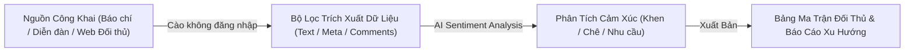

# Bài 3.6: Kỹ Thuật Cào Dữ Liệu Thị Trường & Lắng Nghe Mạng Xã Hội Không Cần Đăng Nhập

> 🚀 **Mã thực hành:** `/start-3-6`  
> 🎯 **Mục tiêu:** Nắm vững phương pháp trích xuất dữ liệu công khai từ các trang tin tức, diễn đàn và mạng xã hội mà hoàn toàn không cần đăng nhập tài khoản cá nhân, bảo đảm an toàn bảo mật tuyệt đối và tự động phân loại cảm xúc khách hàng.

---

## 💡 Tình Báo Thị Trường (Market Intelligence) Mà Không Cần Đăng Nhập

Trong kỷ nguyên kinh doanh số, việc theo dõi động thái đối thủ và lắng nghe ý kiến khách hàng (Social Listening) là yếu tố sống còn. Tuy nhiên, nếu bạn viết script đăng nhập bằng tài khoản cá nhân hoặc dùng API đắt đỏ của các nền tảng mạng xã hội:
* Tài khoản cá nhân rất dễ bị khóa (checkpoint / ban nick).
* Chi phí API hàng tháng lên tới hàng nghìn USD.
* Rủi ro lộ cookie và token bảo mật của công ty.

**Giải pháp của Chuyên gia Tự động hóa:** Tận dụng các giao thức mở công khai (RSS, OpenGraph, Web Meta Scraper, Google Search Cache) để cào dữ liệu bên ngoài mà **không cần bất kỳ tài khoản đăng nhập nào!**

---

## 🛠️ Quy Trình 3 Bước Thu Thập Dữ Liệu Thị Trường



### 1. Thu thập dữ liệu thô (Raw Data Extraction)
Sử dụng các công cụ duyệt web ngầm tích hợp sẵn trong Antigravity để trích xuất tiêu đề bài viết, thời gian đăng tải và các đoạn bình luận công khai.

### 2. Phân loại cảm xúc khách hàng (Sentiment Analysis)
Giao cho AI Agent đọc hàng trăm bình luận của người tiêu dùng để phân thành 3 nhóm rõ rệt:
* **Tích cực (Positive):** Khách hàng khen ngợi tính năng nào nhiều nhất?
* **Tiêu cực (Negative):** Khách hàng đang phàn nàn về dịch vụ hay mức giá ở đâu?
* **Nhu cầu tiềm ẩn (Unmet Needs):** Tính năng nào đối thủ chưa có mà người dùng đang khao khát?

### 3. Xuất bảng dữ liệu so sánh (Benchmarking Matrix)
Tự động xuất kết quả thành bảng so sánh Markdown hoặc file Excel chuẩn hóa để trình Ban Giám Đốc.

---

## 📋 Mẫu Prompt Thu Thập & Phân Tích Ý Kiến Khách Hàng

```markdown
Hãy thực hiện một đợt khảo sát tình báo thị trường về các phần mềm quản lý công việc tại Việt Nam:
1. Thu thập các bài đánh giá công khai và phản hồi của người dùng trên các diễn đàn công nghệ và trang tin trong 3 tháng gần nhất.
2. TUYỆT ĐỐI KHÔNG sử dụng thông tin cá nhân hoặc yêu cầu đăng nhập.
3. Lập bảng phân tích gồm 4 cột:
   - Tên sản phẩm đối thủ
   - Điểm mạnh được khen ngợi nhiều nhất
   - Điểm yếu/Lỗi bị người dùng phàn nàn nhiều nhất
   - Cơ hội phát triển cho sản phẩm TaskFlow
4. Đưa ra 3 đề xuất chiến lược giúp TaskFlow chiếm lĩnh thị phần.
```

---

## 🎯 Bài Tập Thực Hành (Hands-on Challenge)

1. Mở Antigravity và gõ `/start-3-6`.
2. Yêu cầu AI tiến hành khảo sát xu hướng thị trường về nhu cầu "Làm việc từ xa & Quản trị AI" trong năm nay.
3. Trích xuất 10 góc nhìn nổi bật nhất và đóng gói thành file `Bao_Cao_Tinh_Bao_Thi_Truong.md`.
