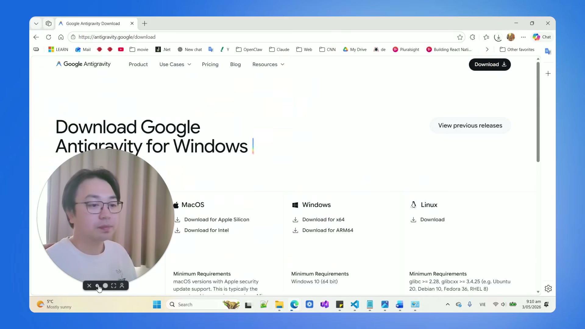

# Bài 3.7: Tự Động Hóa Báo Cáo One-Pager & Thiết Kế Infographic Trực Quan Hóa Dữ Liệu

> 🚀 **Mã thực hành:** `/start-3-7`  
> 🎯 **Mục tiêu:** Làm chủ kỹ thuật đóng gói báo cáo chiến lược chỉ trong 1 trang duy nhất (One-Pager Executive Summary) kèm Infographic trực quan sinh tự động bằng AI, giúp Ban Lãnh Đạo nắm bắt toàn bộ bức tranh kinh doanh chỉ trong 60 giây.

---

## 💡 Nghệ Thuật Báo Cáo One-Pager Cho Ban Giám Đốc

Các Tổng Giám đốc (CEO) và Lãnh đạo cấp cao không có thời gian đọc những bản báo cáo dài 30-50 trang toàn chữ. Nguyên tắc báo cáo hiện đại là **One-Pager Rule (Quy tắc Một Trang)**:
* Toàn bộ tình hình kinh doanh, vấn đề cốt lõi và kiến nghị hành động phải nằm trọn trong 1 trang màn hình duy nhất.
* Đi kèm một hình ảnh trực quan (Infographic hoặc Biểu đồ điều hành) tóm tắt các chỉ số trọng yếu.


*Hình 3.7.1: Tự động hóa tạo báo cáo điều hành và đồ họa trực quan mà không cần biết code.*

---

## 📐 Cấu Trúc Chuẩn Của Bản Báo Cáo One-Pager

Một bản báo cáo điều hành chuyên nghiệp gồm đúng 4 khối nội dung:

```
┌─────────────────────────────────────────────────────────────┐
│ 1. EXECUTIVE SUMMARY (Tóm tắt điều hành trong 3 câu)         │
├─────────────────────────────────────────────────────────────┤
│ 2. KEY METRICS (Bảng 3-4 chỉ số đo lường hiệu quả trọng yếu)│
│    - Doanh thu đạt: 125% kế hoạch                           │
│    - Tỷ lệ chuyển đổi: Tăng 4.2%                            │
│    - Chi phí thu hút khách hàng (CAC): Giảm 15%             │
├─────────────────────────────────────────────────────────────┤
│ 3. BOTTLENECKS & RISKS (Điểm nghẽn & Rủi ro tiềm ẩn)        │
│    - Thiếu hụt 2 nhân sự Senior Sales tại chi nhánh HCM     │
├─────────────────────────────────────────────────────────────┤
│ 4. RECOMMENDED ACTIONS (Đề xuất hành động cần phê duyệt)    │
│    - Phê duyệt ngân sách tuyển dụng khẩn cấp 50 triệu       │
└─────────────────────────────────────────────────────────────┘
```

---

## 🎨 Kỹ Thuật Sinh Infographic Minh Họa Bằng AI

Bạn có thể kết hợp số liệu từ file Excel và ra lệnh cho mô hình tạo ảnh AI tích hợp sẵn trong Antigravity để vẽ Infographic trực quan:

* **Tỷ lệ 16:9:** Dành cho việc nhúng vào slide thuyết trình hoặc báo cáo xem trên máy tính.
* **Tỷ lệ 9:16:** Dành cho việc gửi báo cáo nhanh qua Telegram / Zalo / Thiết bị di động.

```markdown
@So_Lieu_Doanh_Thu_Q3.xlsx
Hãy đóng vai trò Chuyên gia Thiết kế Thông tin (Information Designer):
1. Phân tích số liệu doanh thu và tỷ lệ tăng trưởng trong file đính kèm.
2. Thiết kế một bản tóm tắt One-Pager gửi CEO TaskFlow theo đúng chuẩn 4 khối.
3. Tạo một prompt tạo ảnh Infographic phong cách Minimalist Corporate, tông màu xanh navy và tím công nghệ, thể hiện biểu đồ cột tăng trưởng 125% và các biểu tượng chỉ số tài chính.
4. Đóng gói thành tài liệu báo cáo hoàn chỉnh.
```

---

## 🎯 Bài Tập Thực Hành (Hands-on Challenge)

1. Mở Antigravity và gõ `/start-3-7`.
2. Lấy dữ liệu bán hàng tháng này của công ty TaskFlow.
3. Tạo một bản báo cáo One-Pager gửi Alex (CEO) và kiểm tra xem có vượt quá giới hạn 1 trang A4 hay không.
