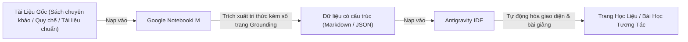
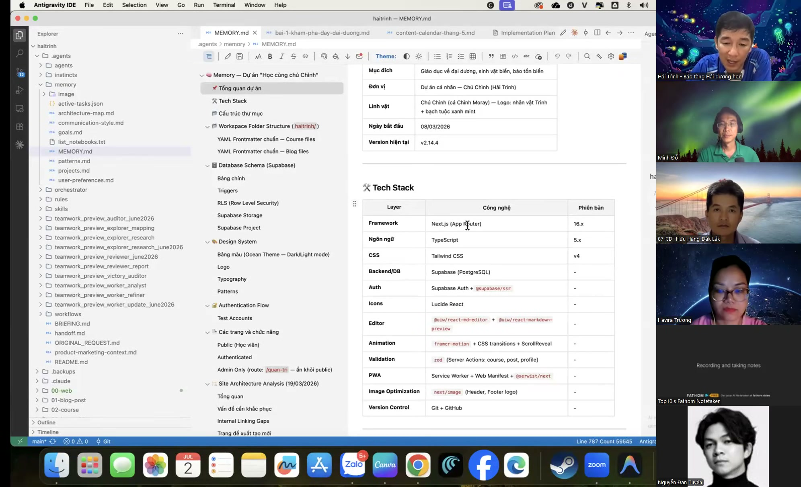

# Bài 3.8: Quy trình kết hợp NotebookLM và Antigravity — Kiểm soát và hạn chế ảo giác tri thức

> 🚀 **Mã thực hành:** `/start-3-8`  
> 🎯 **Mục tiêu:** Nắm vững triết lý xây dựng học liệu chuẩn mực, hạn chế tối đa ảo giác thông tin (Grounding Pipeline). Tận dụng khả năng đối chiếu nguồn tài liệu của NotebookLM kết hợp với sức mạnh tổ chức dữ liệu và lập trình của Antigravity để xây dựng tài liệu học tập hoặc website giáo dục.

---

## 💡 Kiểm soát hiện tượng ảo giác tri thức (AI Hallucination)

Khi ứng dụng AI vào việc biên soạn tài liệu giảng dạy, quy chế công ty hay sách hướng dẫn nghiệp vụ, nguy cơ lớn nhất là **AI bịa đặt thông tin (Hallucination)**. Nó có thể trích dẫn một điều luật không có thật hoặc đưa ra thông số sai lệch nhưng với giọng văn rất tự tin.

Để kiểm soát chặt chẽ vấn đề này, quy trình kết hợp hai công cụ bổ trợ được áp dụng như sau:

---

## 🛠️ Quy trình 3 bước triển khai thực chiến

### Bước 1: Thẩm thấu và lọc tri thức bằng NotebookLM
* Đưa toàn bộ tài liệu nguồn (PDF sách chuyên ngành, tài liệu đào tạo nội bộ) vào Google NotebookLM.
* Yêu cầu NotebookLM trích xuất các **Khái niệm cốt lõi (Core Concepts)** kèm theo số trang chính xác làm bằng chứng:
  > *"Khái niệm X được định nghĩa ở Trang 45, Đoạn 2 của tài liệu đào tạo."*

### Bước 2: Đóng gói thành hạt tri thức có cấu trúc (Structured Knowledge)
Chuyển đổi các phát hiện từ NotebookLM thành định dạng dữ liệu có cấu trúc (Markdown hoặc JSON) chứa đầy đủ:
* Định nghĩa chính xác (Definition)
* Ví dụ minh họa thực tế (Real-world Example)
* Câu hỏi trắc nghiệm kiểm tra hiểu biết (Quiz Question)
* Nguồn tham chiếu cụ thể (Source Citation)

### Bước 3: Antigravity tổ chức dữ liệu và xây dựng giao diện tương tác
Nạp các tệp dữ liệu đã được kiểm chứng vào Antigravity IDE để quản lý và dựng sản phẩm:
* Quản lý bộ nhớ dự án và cấu trúc tài liệu (`MEMORY.md`, `.prompt.md`).
* Tự động sinh giao diện bài học tương tác (HTML/CSS/JS).
* Tích hợp thanh tiến độ học tập và câu hỏi trắc nghiệm kiểm tra tức thì.

*Hình 3.8.1: Không gian làm việc thực tế trong Antigravity IDE — Quản lý bộ nhớ dự án (MEMORY.md) và cấu trúc công nghệ của cổng học liệu.*

---

## 🎯 Bài tập thực hành (Hands-on Challenge)

1. Mở Antigravity và gõ `/start-3-8`.
2. Sử dụng tệp dữ liệu mẫu `Tri_Thuc_Noi_Bo_TaskFlow.json` đã được xác thực nguồn gốc.
3. Ra lệnh cho Antigravity tạo một trang web một tệp duy nhất (Single-file HTML) hiển thị giao diện bài giảng tương tác với câu hỏi trắc nghiệm có chấm điểm tự động.
