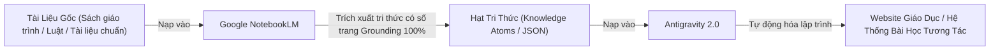
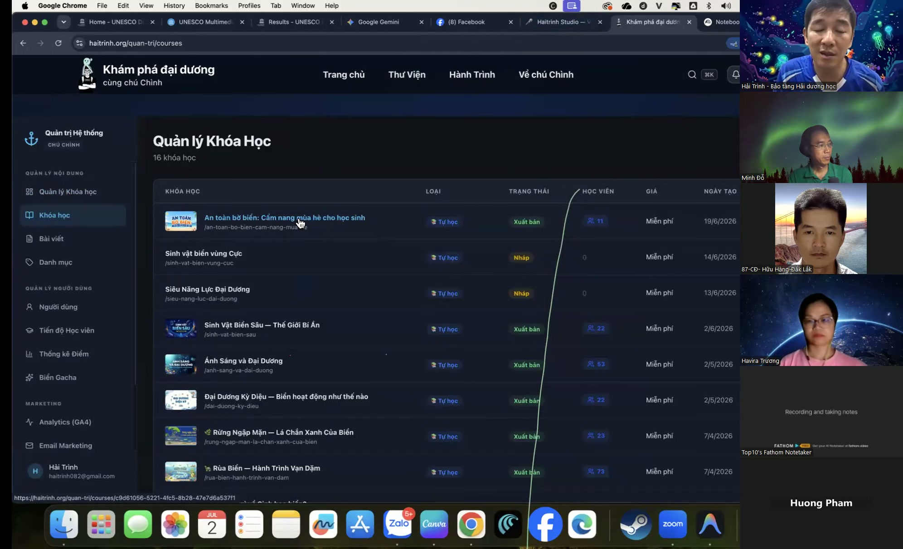

# Bài 3.8: Đường Ống Sư Phạm NotebookLM + Antigravity — Triệt Tiêu Ảo Giác Tri Thức

> 🚀 **Mã thực hành:** `/start-3-8`  
> 🎯 **Mục tiêu:** Nắm vững triết lý xây dựng học liệu chuẩn mực sư phạm không ảo giác (No-Hallucination Pipeline). Tận dụng khả năng trích dẫn nguồn tuyệt đối của NotebookLM kết hợp với sức mạnh lập trình và tự động hóa của Antigravity để xây dựng website giáo dục hoàn chỉnh.

---

## 💡 Nỗi Ám Ảnh Về "Ảo Giác Tri Thức" (AI Hallucination)

Khi ứng dụng AI vào việc biên soạn tài liệu giảng dạy, quy chế công ty hay sách hướng dẫn nghiệp vụ, nguy cơ lớn nhất là **AI bịa đặt thông tin (Hallucination)**. Nó có thể trích dẫn một điều luật không có thật, hoặc bịa ra một thông số kỹ thuật sai lệch nhưng với giọng văn vô cùng tự tin!

Để giải quyết tận gốc bài toán này, các chuyên gia giáo dục và kỹ sư tri thức sử dụng **Mô hình Phối hợp 2 Cỗ Máy:**

*Hình 3.8.1: Mô hình đường ống khép kín bảo đảm tính xác thực 100% của tri thức.*

---

## 🛠️ Quy Trình 3 Chặng Triển Khai Thực Chiến

### Chặng 1: Thẩm thấu và lọc tri thức bằng NotebookLM
* Đưa toàn bộ tài liệu nguồn (PDF sách chuyên ngành, tài liệu đào tạo nội bộ) vào Google NotebookLM.
* Yêu cầu NotebookLM trích xuất các **Khái niệm cốt lõi (Core Concepts)** kèm theo số trang chính xác làm bằng chứng:
  > *"Khái niệm X được định nghĩa ở Trang 45, Đoạn 2 của sách giáo trình."*

### Chặng 2: Đóng gói thành Hạt tri thức có cấu trúc (Structured Atoms)
Chuyển đổi các phát hiện từ NotebookLM thành định dạng dữ liệu có cấu trúc (Markdown hoặc JSON) chứa đầy đủ:
* Định nghĩa chính xác (Definition)
* Ví dụ minh họa thực tế (Real-world Example)
* Câu hỏi trắc nghiệm kiểm tra hiểu biết (Quiz Question)
* Nguồn tham chiếu (Source Citation)

### Chặng 3: Antigravity tự động dựng Website Giáo Dục đa tính năng
Nạp các tệp dữ liệu đã được kiểm chứng vào Antigravity và ra lệnh cho Agent:
* Tự động sinh giao diện bài học trực quan (HTML/CSS/React).
* Tích hợp thanh tiến độ học tập (Progress Bar).
* Tích hợp bài tập trắc nghiệm có phản hồi đúng/sai tức thì.

*Hình 3.8.2: Sản phẩm website giáo dục đa tính năng được AI tự động đóng gói chỉ sau vài phút.*

---

## 🎯 Bài Tập Thực Hành (Hands-on Challenge)

1. Mở Antigravity và gõ `/start-3-8`.
2. Sử dụng tệp dữ liệu mẫu `Tri_Thuc_Noi_Bo_TaskFlow.json` đã được xác thực nguồn gốc.
3. Ra lệnh cho Antigravity tạo một trang web một tệp duy nhất (Single-file HTML) hiển thị giao diện bài giảng tương tác với câu hỏi trắc nghiệm có chấm điểm tự động.
