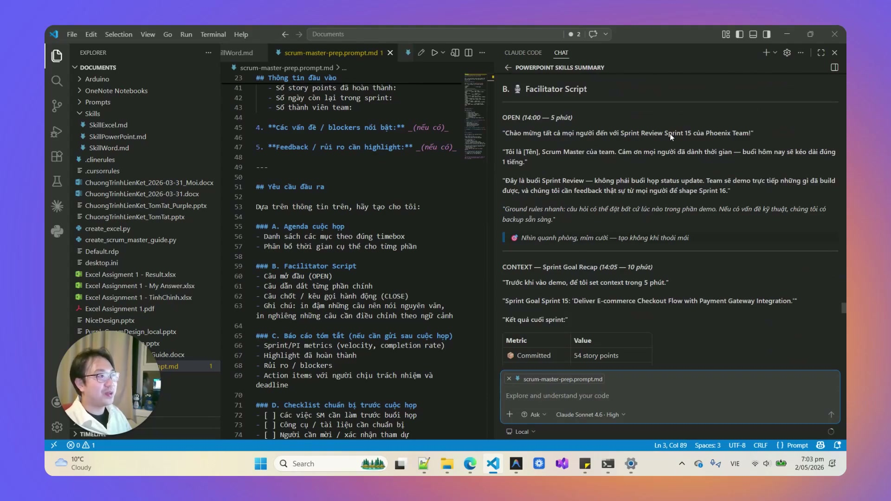
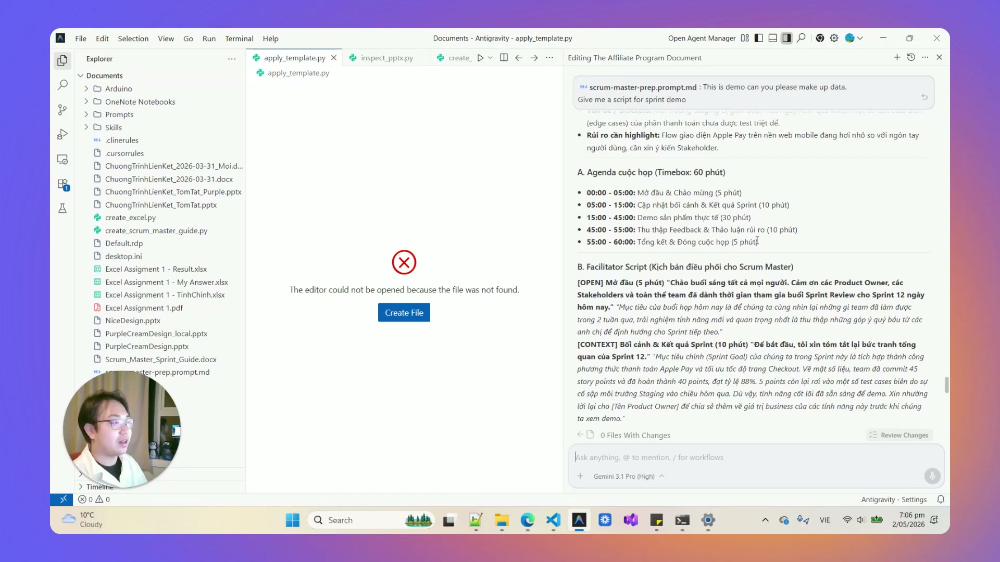

# Bài 3.9: Thiết kế Scrum Master & Meeting Facilitator Agent — Kịch bản điều phối song ngữ

> 🚀 **Mã thực hành:** `/start-3-9`  
> 🎯 **Mục tiêu:** Đóng gói các nguyên tắc Scrum và kỹ năng điều phối cuộc họp vào một AI Agent chuyên dụng. Tự động sinh kịch bản chi tiết 5 phần cho các cuộc họp nội bộ một cách nhanh chóng, hỗ trợ song ngữ Anh - Việt giúp nhóm làm việc mạch lạc và đúng mục tiêu.

---

## 💡 Thách thức trong việc điều phối cuộc họp hiệu quả

Nhiều nhân sự văn phòng và quản lý thường gặp khó khăn với các cuộc họp kéo dài:
* Không có mục tiêu rõ ràng, vào họp mới loay hoay bàn xem thảo luận nội dung gì.
* Một vài cá nhân nói quá nhiều khiến cuộc họp bị vượt quá thời lượng cho phép.
* Kết thúc cuộc họp mà không có phân công cụ thể ai làm việc gì, thời hạn hoàn thành là bao giờ.

**Scrum Master Agent hỗ trợ giải quyết vấn đề này:** Đóng vai trò là Người điều phối (Facilitator) chuẩn bị trước khung kịch bản, câu hỏi gợi mở và phân bổ thời gian hợp lý cho từng phần.


*Hình 3.9.1: Cấu trúc file `.prompt.md` chuẩn POM đóng gói quy chuẩn điều phối, phân bổ thời gian và câu hỏi gợi mở.*

---

## 📐 Cấu trúc kịch bản điều phối 5 phần tiêu chuẩn

Mọi kịch bản do Scrum Master Agent sinh ra đều tuân thủ 5 phần cốt lõi:

```
┌─────────────────────────────────────────────────────────────┐
│ 1. MỤC TIÊU & THỜI GIAN (Objective & Timeboxing)            │
│    - Loại họp: Sprint Planning / Daily Standup / Retro      │
│    - Tổng thời lượng: 45 phút                               │
├─────────────────────────────────────────────────────────────┤
│ 2. CHƯƠNG TRÌNH CHI TIẾT TỪNG PHÚT (Minute-by-minute Agenda)│
│    - 00:00 - 05:00: Check-in & Điểm danh                    │
│    - 05:00 - 20:00: Rà soát mục tiêu cam kết                │
│    - 20:00 - 35:00: Bóc tách rào cản & giải pháp            │
│    - 35:00 - 45:00: Thống nhất cam kết & phân công          │
├─────────────────────────────────────────────────────────────┤
│ 3. BỘ CÂU HỎI GỢI MỞ (Facilitation Prompts)                 │
│    - "Điều gì đang cản trở tiến độ của nhóm nhiều nhất?"    │
│    - "Nếu chỉ được chọn 1 ưu tiên, ta sẽ chọn việc nào?"    │
├─────────────────────────────────────────────────────────────┤
│ 4. QUẢN LÝ BÃI ĐỖ XE Ý KIẾN (Parking Lot)                   │
│    - Nơi tạm cất các chủ đề phát sinh ngoài lề để tránh     │
│      lạc đề và đảm bảo đúng khung thời gian.                │
├─────────────────────────────────────────────────────────────┤
│ 5. BẢNG BIÊN BẢN HÀNH ĐỘNG (Action Items & Owner)           │
│    - [Việc cần làm] ──► [Người chịu trách nhiệm] ──► [Hạn]  │
└─────────────────────────────────────────────────────────────┘
```


*Hình 3.9.2: Kịch bản được Antigravity tạo ra chi tiết từng phần (Timebox 60 phút) kèm lời thoại dẫn dắt bằng cả tiếng Việt và tiếng Anh.*

---

## 📋 Mẫu câu lệnh khởi tạo Scrum Master Agent

```markdown
Hãy đóng vai trò chuyên viên điều phối cuộc họp và Scrum Master:
1. Soạn kịch bản cho cuộc họp: SPRINT RETROSPECTIVE (Đánh giá sau chiến dịch Q3) của công ty TaskFlow.
2. Tổng thời lượng: 60 phút. Thành phần tham dự: 8 người (CEO, Marketing, Dev, Sales).
3. Áp dụng chuẩn kịch bản 5 phần:
   - Phân bổ thời gian theo từng khoảng 10-15 phút.
   - Thiết lập 4 câu hỏi gợi mở theo mô hình 4Ls (Liked - Learned - Lacked - Longed For).
   - Thiết kế khu vực "Parking Lot" để xử lý các tranh luận ngoài lề.
   - Tạo bảng Action Items theo định dạng Markdown.
4. Trình bày kịch bản SONG NGỮ (Anh - Việt song song).
```

---

## 🎯 Bài tập thực hành (Hands-on Challenge)

1. Mở Antigravity và gõ `/start-3-9`.
2. Yêu cầu AI tạo kịch bản cho một buổi họp giải quyết sự cố dịch vụ khách hàng trong 30 phút.
3. Sử dụng kịch bản này để đóng vai người chủ trì và quan sát cách câu hỏi gợi mở giúp nhóm tập trung vào giải pháp thay vì phàn nàn.
