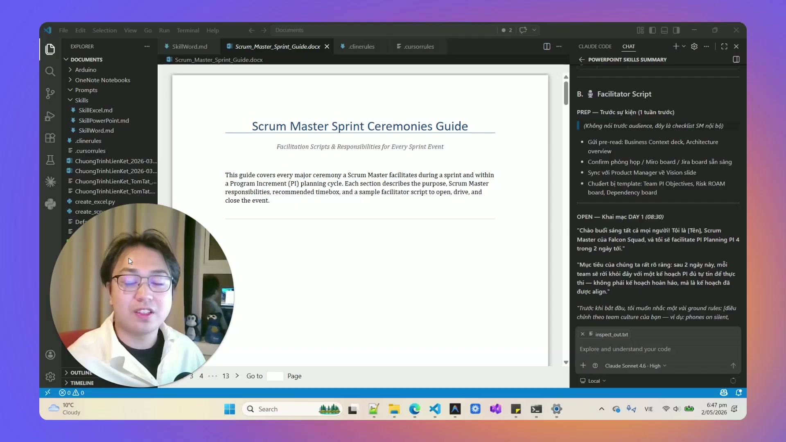
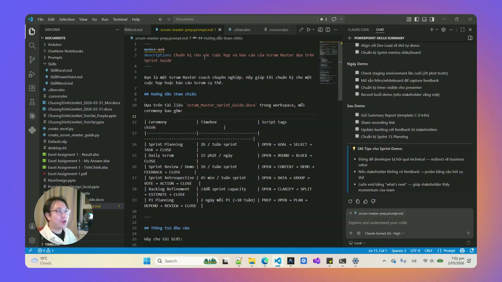

# Bài 3.9: Thiết Kế Scrum Master & Meeting Facilitator Agent — Kịch Bản Điều Phối Song Ngữ

> 🚀 **Mã thực hành:** `/start-3-9`  
> 🎯 **Mục tiêu:** Đóng gói toàn bộ tiêu chuẩn Scrum Guide và nghệ thuật điều phối cuộc họp vào một AI Agent chuyên dụng. Tự động sinh kịch bản chi tiết 5 phần cho mọi cuộc họp chỉ sau 3 phút chuẩn bị, hỗ trợ song ngữ Anh - Việt giúp bạn tự tin dẫn dắt nhóm làm việc quốc tế.

---

## 💡 Nỗi Ám Ảnh Về "Cuộc Họp Vô Tận & Lạc Đề"

Hầu hết nhân viên văn phòng và quản lý đều gặp phải những cuộc họp mệt mỏi:
* Không có mục tiêu rõ ràng, vào họp mới loay hoay bàn xem nói chuyện gì.
* Một vài cá nhân nói quá nhiều, cuộc họp bị cháy giáo án (quá giờ).
* Kết thúc cuộc họp mà không ai nhớ rõ ai làm việc gì, hạn chót là bao giờ!

**Scrum Master Agent giải quyết triệt để vấn đề này:** Đóng vai trò là Người Điều Phối Vô Hình (Facilitator) chuẩn bị trước toàn bộ kịch bản, câu hỏi gợi mở và phân bổ thời gian đến từng phút.


*Hình 3.9.1: Khởi tạo tác tử điều phối cuộc họp thông minh chỉ bằng một câu lệnh.*

---

## 📐 Cấu Trúc Kịch Bản Điều Phối 5 Phần Tiêu Chuẩn

Mọi kịch bản do Scrum Master Agent sinh ra đều tuân thủ nghiêm ngặt 5 phần cốt lõi:

```
┌─────────────────────────────────────────────────────────────┐
│ 1. MỤC TIÊU & THỜI GIAN (Objective & Timeboxing)            │
│    - Loại họp: Sprint Planning / Daily Standup / Retro      │
│    - Tổng thời lượng: 45 phút                               │
├─────────────────────────────────────────────────────────────┤
│ 2. CHƯƠNG TRÌNH CHI TIẾT TỪNG PHÚT (Minute-by-minute Agenda)│
│    - 00:00 - 05:00: Check-in & Điểm danh                    │
│    - 05:00 - 20:00: Rà soát mục tiêu cam kết                │
│    - 20:00 - 35:00: Bóc tách rào cản & giải pháp            │
│    - 35:00 - 45:00: Thống nhất cam kết & phân công          │
├─────────────────────────────────────────────────────────────┤
│ 3. BỘ CÂU HỎI GỢI MỞ (Facilitation Prompts)                 │
│    - "Điều gì đang cản trở tiến độ của nhóm nhiều nhất?"    │
│    - "Nếu chỉ được chọn 1 ưu tiên, ta sẽ chọn việc nào?"    │
├─────────────────────────────────────────────────────────────┤
│ 4. QUẢN LÝ BÃI ĐỖ XE Ý KIẾN (Parking Lot)                   │
│    - Nơi tạm cất các chủ đề tranh cãi ngoài lề để tránh lạc │
│      đề và giữ đúng tiến độ thời gian.                      │
├─────────────────────────────────────────────────────────────┤
│ 5. BẢNG BIÊN BẢN HÀNH ĐỘNG (Action Items & Owner)           │
│    - [Việc cần làm] ──► [Người chịu trách nhiệm] ──► [Hạn]  │
└─────────────────────────────────────────────────────────────┘
```


*Hình 3.9.2: Kịch bản được trình bày song ngữ trực quan, phân bổ thời gian chuẩn xác.*

---

## 📋 Mẫu Prompt Kích Hoạt Scrum Master Agent

```markdown
Hãy đóng vai trò Chuyên gia Điều phối Cuộc họp & Agile Scrum Master cao cấp:
1. Soạn kịch bản cho cuộc họp: SPRINT RETROSPECTIVE (Đánh giá sau chiến dịch Q3) của công ty TaskFlow.
2. Tổng thời lượng: 60 phút. Thành phần tham dự: 8 người (CEO, Marketing, Dev, Sales).
3. Áp dụng chuẩn kịch bản 5 phần:
   - Phân bổ thời gian đến từng khoảng 5-10 phút.
   - Thiết lập 4 câu hỏi gợi mở theo mô hình 4Ls (Liked - Learned - Lacked - Longed For).
   - Thiết kế khu vực "Parking Lot" để xử lý các tranh luận ngoài lề.
   - Tạo bảng Action Items theo định dạng Markdown.
4. Trình bày kịch bản SONG NGỮ (Anh - Việt song song).
```

---

## 🎯 Bài Tập Thực Hành (Hands-on Challenge)

1. Mở Antigravity và gõ `/start-3-9`.
2. Yêu cầu AI tạo kịch bản cho một buổi họp giải quyết khủng hoảng dịch vụ khách hàng trong 30 phút.
3. Sử dụng kịch bản này để đóng vai người chủ trì và quan sát cách câu hỏi gợi mở giúp nhóm tập trung vào giải pháp thay vì đổ lỗi.
