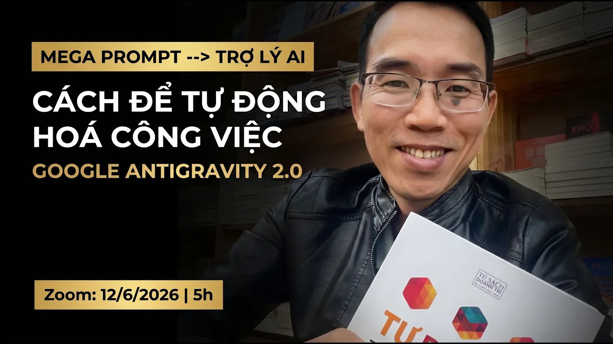
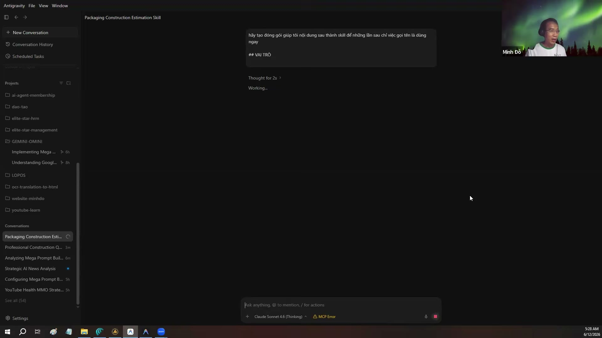

# Bài đọc thêm 07: Từ Mega Prompt đến trợ lý AI tự động hóa (AI Agent)

> 📺 **Nguồn video tham khảo:** [Mega Prompt đến Trợ Lý AI | Google Antigravity 2.0](https://www.youtube.com/watch?v=bwbLd4o-rwo) (Thời lượng: 1:22:00 — Chia sẻ bởi Hoàng Đức Minh)

---

## ⚡ Sự khác biệt giữa Chatbot truyền thống và AI-Agent

Trước đây, khi dùng ChatGPT hay Claude trên web, người dùng thường viết những câu lệnh rất dài và phức tạp (gọi là **Mega Prompt**) gồm nhiều trang yêu cầu: *"Bạn là một chuyên gia..., hãy đọc các dữ liệu sau..., hãy làm theo 10 bước sau..."*.

Tuy nhiên, Mega Prompt trên giao diện web vẫn có những hạn chế thực tế:
* Người dùng vẫn phải copy-paste dữ liệu qua lại thủ công.
* Khi gặp bài toán lớn gồm nhiều chương mục hoặc nhiều file, Chatbot xử lý **tuần tự từng việc một** (xong chương 1 mới đến chương 2), dễ làm phát sinh thời gian chờ đợi và nghẽn bộ nhớ ngữ cảnh.

> 📸 *Ảnh chụp màn hình thực tế từ video: So sánh giữa việc viết prompt thủ công và xây dựng hệ thống tác tử tự vận hành.*

---

## 🚀 Cơ chế chia nhỏ dữ liệu và thực thi song song (Parallel Execution)

Trong video, diễn giả Hoàng Đức Minh giải thích cơ chế làm việc theo nhóm tác tử của Antigravity:

> 📸 *Ảnh chụp màn hình thực tế từ video: Antigravity chia nhỏ các phần độc lập và điều phối tác tử xử lý đồng thời.*

### Cơ chế chia nhỏ để xử lý (Divide and Conquer):
* **Tình huống:** Bạn có một cuốn cẩm nang công ty hoặc tài liệu đào tạo gồm 10 chương cần biên tập lại.
* **Cách làm tuần tự:** Làm lần lượt từng chương $\longrightarrow$ Dễ bị đuối ý hoặc quên quy tắc của chương trước.
* **Cách Antigravity thực hiện:**
  1. Phân tích cấu trúc và nhận diện các phần nội dung có thể làm song song.
  2. Kích hoạt các sub-agents xử lý từng phần độc lập.
  3. Tổng hợp lại thành tài liệu hoàn chỉnh, giúp tiết kiệm đáng kể thời gian so với xử lý tuần tự từng bước.

---

## 💡 Đúc kết tư duy dành cho người quản lý

* Không nhất thiết phải học thuộc các công thức viết prompt quá phức tạp.
* Trọng tâm là học cách **thiết kế quy trình (Workflow) và thiết lập quy chuẩn (Rules)** để AI hiểu rõ ngữ cảnh, chia việc hợp lý và phối hợp nhịp nhàng.
