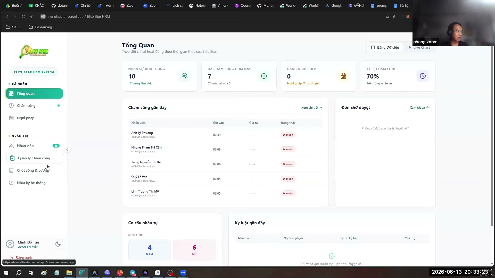
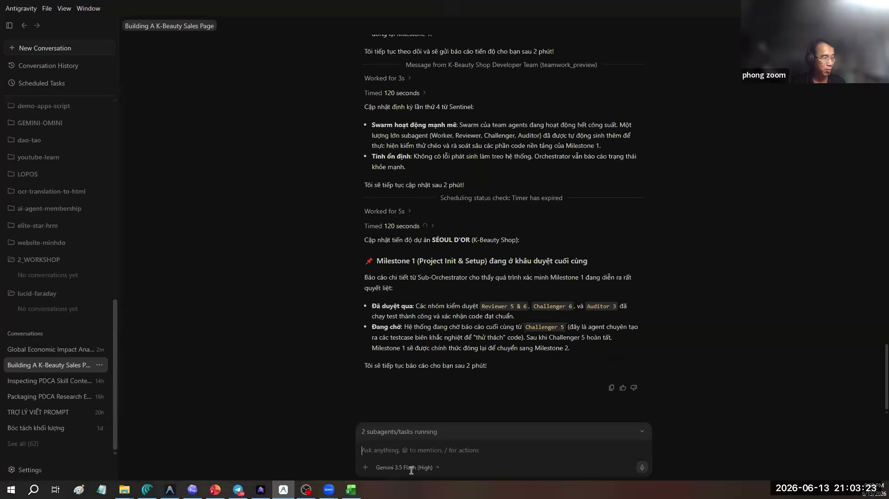

# Bài Đọc Thêm 08: So Sánh Toàn Diện Antigravity IDE & Antigravity 2.0 (Agent Manager)

> 📺 **Nguồn Video tham khảo:** [Antigravity IDE # Antigravity 2.0 | Đâu là sự lựa chọn hoàn hảo](https://www.youtube.com/watch?v=CYwA2np_LnQ) (Thời lượng: 1:46:40 — Chia sẻ bởi Hoàng Đức Minh)

---

## 🔍 Bối Cảnh Lịch Sử: Sự Phân Tách Hai Ứng Dụng Độc Lập

Từ sự kiện Google I/O 2026, Google đã chính thức tách hệ sinh thái Antigravity thành hai phần mềm chuyên biệt:
1. **Antigravity IDE (Integrated Development Environment):** Giao diện làm việc tích hợp (thừa hưởng chuẩn mở của VS Code).
2. **Antigravity 2.0 (Standalone Desktop Application / Agent Manager):** Giao diện chuyên dụng để điều phối nhiều AI-Agent (Multi-Agent First).

> 📸 *Ảnh chụp màn hình thực tế từ video: Hai giao diện độc lập được sử dụng song song trong môi trường làm việc thực tế.*

---

## ⚖️ Bảng So Sánh Chi Tiết: Khi Nào Nên Dùng Ứng Dụng Nào?

| Đặc điểm so sánh | Antigravity IDE | Antigravity 2.0 (Agent Manager) |
| :--- | :--- | :--- |
| **Bản chất** | Môi trường xem/sửa file, cài tiện ích mở rộng | Trung tâm chỉ huy nhiều AI-Agent độc lập |
| **Màn hình chính** | Chia 3 phần rõ ràng: Explorer, Editor xem file, Chat AI | Khung chat lệnh trung tâm, danh mục dự án bên trái |
| **Khả năng xem file** | Đọc được Markdown, Text, Office (.docx, .xlsx) qua Extension | Không có màn hình soạn thảo văn bản trực tiếp |
| **Sức mạnh nổi bật** | Chỉnh sửa tỉ mỉ từng câu chữ, gỡ lỗi, tùy biến giao diện | Khởi tạo dự án cực nhanh bằng lệnh `/teamwork-preview` |
| **Đối tượng phù hợp** | Dân văn phòng, người thích quản lý file trực quan | Người quản lý cần giao việc lớn cho nhiều AI cùng lúc |

---

## 🔄 Cơ Chế Chuyển Đổi Song Hành (Switching Workflow)

Điểm mấu chốt được anh Hoàng Đức Minh nhấn mạnh: **Bạn không cần phải chọn một và bỏ một!** Hai ứng dụng này liên kết mật thiết với nhau:

> 📸 *Ảnh chụp màn hình thực tế từ video: Nút bấm 'Open IDE' giúp chuyển đổi tức thì dự án từ Agent Manager sang Antigravity IDE.*

* **Quy trình phối hợp chuẩn:**
  1. Dùng **Antigravity 2.0** để khởi tạo nhanh toàn bộ khung sườn dự án chỉ với một câu lệnh tổng quát (ví dụ: tạo cấu trúc website, dựng bộ khung kế hoạch 12 tuần).
  2. Khi cần đi sâu vào chi tiết, bấm nút **Open IDE** để mở ngay dự án đó trên **Antigravity IDE**.
  3. Tại IDE, bạn dùng Extension để mở file Word/Excel kiểm tra, tinh chỉnh từng câu chữ và lưu bản phát hành cuối cùng.
