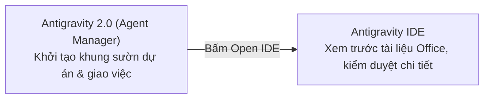

# Bài đọc thêm 08: So sánh toàn diện Antigravity IDE và Antigravity 2.0 (Agent Manager)

> 📺 **Nguồn video tham khảo:** [Antigravity IDE # Antigravity 2.0 | Đâu là sự lựa chọn hoàn hảo](https://www.youtube.com/watch?v=CYwA2np_LnQ) (Thời lượng: 1:46:40 — Chia sẻ bởi Hoàng Đức Minh)

---

## 🔍 Bối cảnh: Sự phân tách hai ứng dụng chuyên biệt

Từ sự kiện Google I/O 2026, Google đã phát triển hệ sinh thái Antigravity thành hai phần mềm chuyên biệt bổ trợ nhau:
1. **Antigravity IDE (Integrated Development Environment):** Giao diện làm việc tích hợp (thừa hưởng chuẩn mở của VS Code), tập trung vào cấu trúc file, tiện ích mở rộng và mã nguồn/tài liệu chi tiết.
2. **Antigravity 2.0 (Standalone Desktop Application / Agent Manager):** Giao diện chuyên dụng để quản lý dự án, theo dõi phiên làm việc và điều phối nhiều AI-Agent chạy song song.

> 📸 *Ảnh chụp màn hình thực tế từ video: Môi trường Antigravity 2.0 quản lý danh mục dự án bên trái và nhật ký thực thi của các tác tử.*

---

## ⚖️ Bảng so sánh chi tiết: Khi nào nên dùng ứng dụng nào?

| Đặc điểm so sánh | Antigravity IDE | Antigravity 2.0 (Agent Manager) |
| :--- | :--- | :--- |
| **Bản chất** | Môi trường xem/sửa file, cài tiện ích mở rộng | Trung tâm chỉ huy nhiều AI-Agent độc lập |
| **Màn hình chính** | Chia 3 phần rõ ràng: Explorer, Editor xem file, Chat AI | Khung chat lệnh trung tâm, danh mục dự án bên trái |
| **Khả năng xem file** | Đọc được Markdown, Text, Office (.docx, .xlsx) qua Extension | Tập trung vào luồng chat và kết quả xuất bản |
| **Sức mạnh nổi bật** | Chỉnh sửa tỉ mỉ từng câu chữ, gỡ lỗi, tùy biến giao diện | Khởi tạo dự án nhanh chóng, theo dõi tiến độ tổng thể |
| **Đối tượng phù hợp** | Dân văn phòng, người thích quản lý file trực quan | Người quản lý cần theo dõi tiến độ và giao việc tổng thể |

---

## 🔄 Cơ chế chuyển đổi linh hoạt (Switching Workflow)

Điểm mấu chốt được diễn giả Hoàng Đức Minh nhấn mạnh: **Người dùng không cần phải chọn một và bỏ một.** Hai ứng dụng này liên kết mật thiết với nhau trong luồng công việc:

* **Quy trình phối hợp chuẩn:**
  1. Dùng **Antigravity 2.0** để khởi tạo nhanh toàn bộ khung sườn dự án với một câu lệnh tổng quát (ví dụ: tạo cấu trúc website, dựng bộ khung kế hoạch công việc).
  2. Khi cần đi sâu vào chi tiết, bấm nút **Open IDE** để mở ngay dự án đó trên **Antigravity IDE**.
  3. Tại IDE, bạn dùng Extension để mở file Word/Excel kiểm tra, tinh chỉnh từng câu chữ và lưu bản hoàn thiện.
