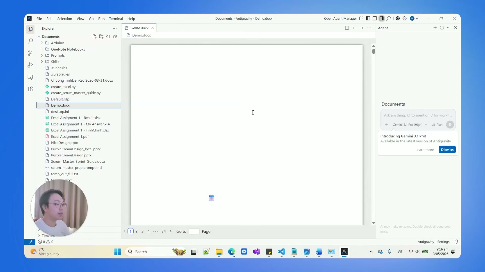

# Bài đọc thêm 09: Ứng dụng Antigravity cho công việc văn phòng — Tối ưu hiệu suất cho người không chuyên công nghệ

> 📺 **Nguồn video tham khảo:** [AI Văn Phòng #1: Antigravity | X10 Hiệu Suất, Miễn Phí, 0 Kiến Thức AI](https://www.youtube.com/watch?v=jl5vTGFC5IQ) (Thời lượng: 05:17 — Kênh PieLikeClaw)

---

## 🎯 Khác biệt giữa Chatbot trên trình duyệt web và AI Agent trên máy tính

Nhiều nhân sự văn phòng đã quen thuộc với ChatGPT hay Gemini trên trình duyệt web, nhưng đôi khi gặp phải các thao tác thủ công lặp lại:
* Phải tự tải file lên từng lần một.
* Phải copy câu trả lời dán ngược lại vào Word/Excel.
* Chatbot trên web không thể trực tiếp đọc cấu trúc thư mục hoặc tạo file lưu ngay vào ổ cứng máy tính.

> 📸 *Ảnh chụp màn hình thực tế từ video: Trang tải phần mềm Antigravity chính thức từ Google (hỗ trợ đa nền tảng Windows, macOS, Linux).*

---

## 💡 Ba lợi ích thiết thực cho người dùng văn phòng

> 📸 *Ảnh chụp màn hình thực tế từ video: Mở và chỉnh sửa trực tiếp tài liệu Office trong Antigravity IDE kết hợp trợ lý AI.*

1. **Chi phí tiếp cận thấp:** Người dùng có thể bắt đầu làm quen với các tính năng cơ bản hoàn toàn miễn phí thông qua tài khoản Google mà không cần đầu tư phần mềm đắt tiền.
2. **Thao tác trực tiếp với file cục bộ:** Bằng cách gõ `@ten_file`, AI có thể đọc nội dung, hỗ trợ rà soát, đề xuất chỉnh sửa và cập nhật tài liệu ngay trong thư mục làm việc của bạn.
3. **Giao tiếp bằng tiếng Việt tự nhiên:** Không yêu cầu kỹ năng lập trình phức tạp; người dùng chỉ cần mô tả rõ ràng yêu cầu công việc như khi trao đổi với một cộng sự.
