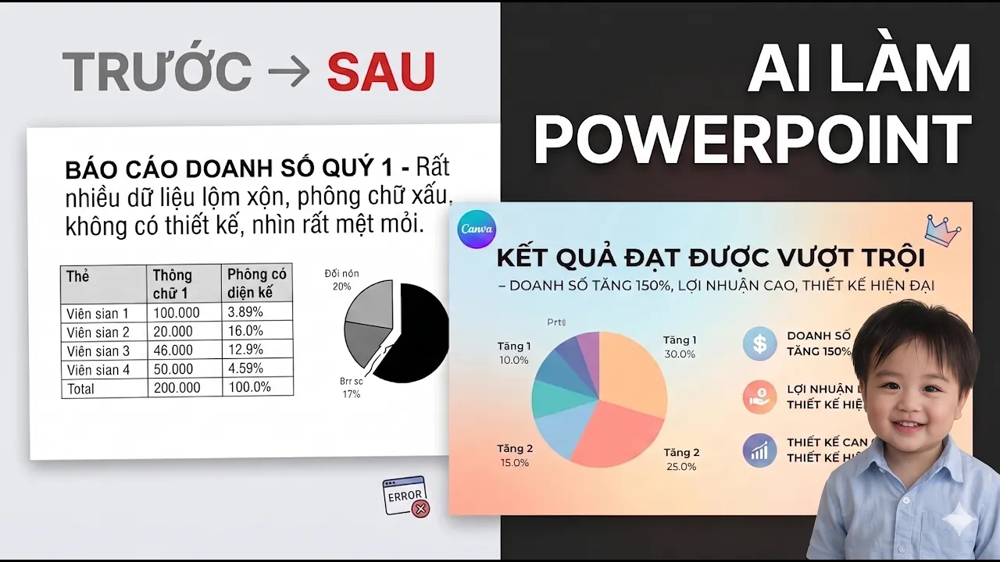

# Bài Đọc Thêm 10: Tự Động Tạo Slide PowerPoint Theo Mẫu Doanh Nghiệp (Không Tốn Token, Dùng Vĩnh Viễn)

> 📺 **Nguồn Video tham khảo:** [AI Văn Phòng #6: Dạy AI Tạo PowerPoint Theo Mẫu | Không Tốn Token, Dùng Lại Vĩnh Viễn](https://www.youtube.com/watch?v=w3Z2uVgIWQ0) (Thời lượng: 07:40 — Kênh PieLikeClaw)

---

## 😫 Nỗi Đau Khi Tạo Slide Thuyết Trình Bằng AI Thông Thường

Hiện nay có nhiều công cụ tạo slide trực tuyến bằng AI (Gamma, Tome, Canva AI...), tuy nhiên người làm doanh nghiệp thường gặp 2 rào cản lớn:
1. **Lệch chuẩn nhận diện thương hiệu:** Màu sắc, logo, font chữ và bố cục không đồng bộ với bộ mẫu PowerPoint chuẩn (Brand Guidelines) của công ty.
2. **Chi phí token đắt đỏ:** Mỗi lần sinh lại một bản thuyết trình mới là lại tốn thêm tiền mua credit.

> 📸 *Ảnh cắt từ video gốc (02:08): Nếu không có mẫu Slide Master, AI chỉ điền text thô sơ lên nền trắng không có bố cục.*

---

## 🛠️ Giải Pháp: Đóng Gói Slide Master Thành Kỹ Năng (Skill) Dùng Lại Vĩnh Viễn

> 📸 *Ảnh cắt từ video gốc (03:50): Khi nạp file mẫu Slide Master, slide xuất ra giữ trọn logo, màu sắc và layout thương hiệu chuyên nghiệp.*

> 📸 *Ảnh cắt từ video gốc (05:30): Tạo prompt đóng gói thành Skill giúp các lần sau chỉ cần nạp tên file là xong, không tốn token.*

### Quy trình 3 bước thực hiện:
1. **Chuẩn bị file mẫu PowerPoint (`.pptx`):** Chứa sẵn logo công ty, font chữ thương hiệu, màu sắc chủ đạo và các bố cục khung nội dung mẫu.
2. **Dạy AI quy tắc điền nội dung (Workflow/Skill):** Thiết lập chỉ dẫn để AI hiểu:
   * Slide 1: Bìa (Tiêu đề, Tác giả, Ngày tháng).
   * Slide 2: Mục tiêu & Vấn đề cần giải quyết.
   * Slide 3-5: Nội dung chi tiết & Số liệu kinh doanh.
   * Slide cuối: Kết luận & Kêu gọi hành động (CTA).
3. **Thực thi thần tốc:** Khi có tài liệu họp hoặc đề cương mới, bạn chỉ cần gõ:
   > *"Dựa trên báo cáo @ke_hoach_kinh_doanh.docx, hãy tạo file trình chiếu PowerPoint theo mẫu chuẩn của công ty."*
   
AI sẽ tự sinh ra file `.pptx` hoàn chỉnh nằm ngay trong thư mục máy tính của bạn, mở bằng PowerPoint bình thường!
