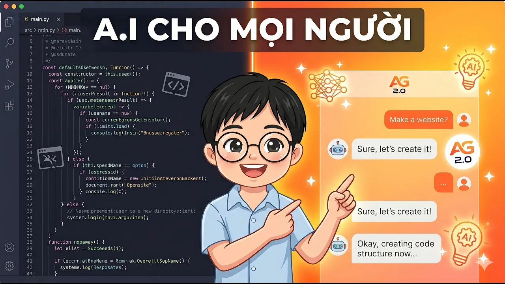
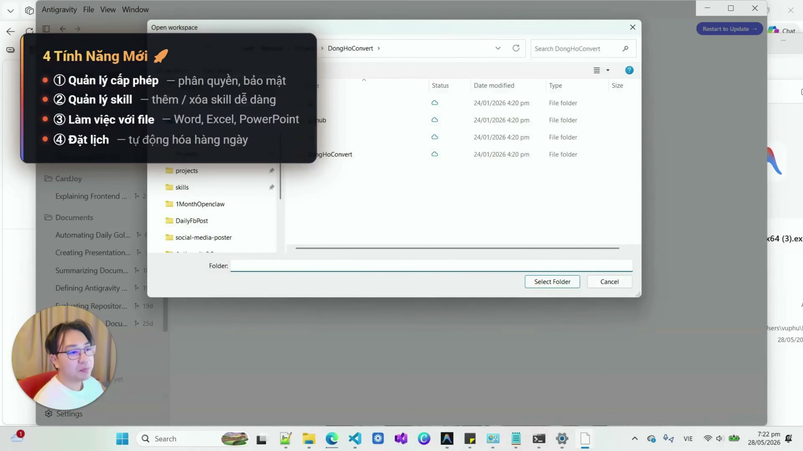
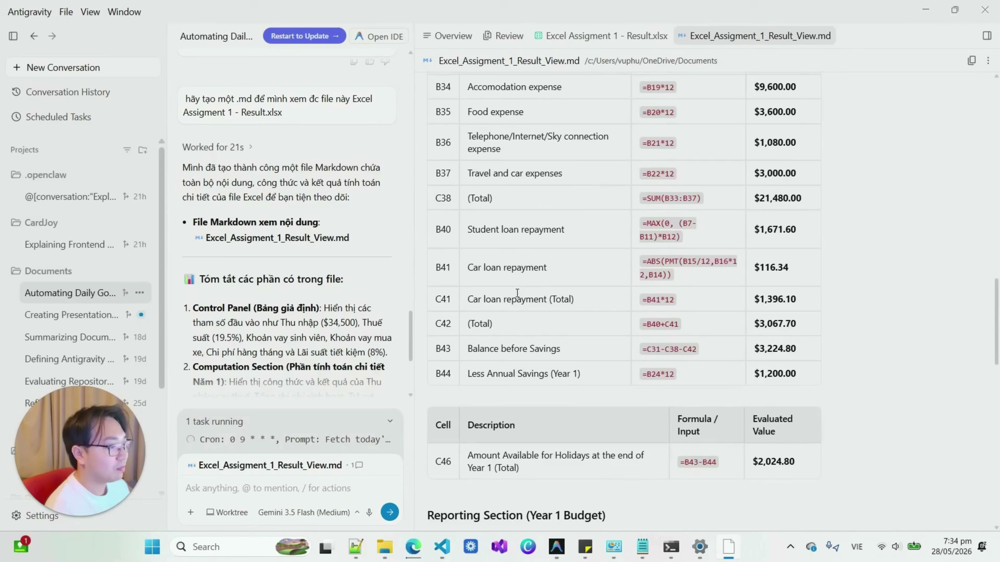

# Bài Đọc Thêm 11: Giải Mã Sự Kiện Google Tách Antigravity Cho Người Dùng Phổ Thông

> 📺 **Nguồn Video tham khảo:** [Google Vừa Tách Antigravity: A.I Giờ Ai Cũng Dùng Được](https://www.youtube.com/watch?v=eoz-muc9Y9Y) (Thời lượng: 10:04 — Kênh PieLikeClaw)

---

## 📢 Bước Ngoặt Lớn: AI Không Còn Là "Đặc Quyền" Của Lập Trình Viên

Trước đây, khi nhắc đến các công cụ điều phối AI Agent thế hệ mới (như Cursor, Windsurf hay Antigravity thời kỳ đầu), giao diện thường ngập tràn các đoạn mã, terminal và cửa sổ gỡ lỗi khiến dân kinh doanh, văn phòng nhìn vào là "choáng ngợp".

Tại bản cập nhật Antigravity 2.0, Google đã đưa ra một quyết định chiến lược: **Tách đôi hoàn toàn hệ thống**.

> 📸 *Ảnh chụp màn hình thực tế từ video: Giao diện Antigravity 2.0 được tối giản hóa triệt để, tập trung vào ô giao việc trung tâm.*

---

## 🌟 Vì Sao Phiên Bản 2.0 Giúp "Ai Cũng Dùng Được"?

> 📸 *Ảnh chụp màn hình thực tế từ video: Trải nghiệm người dùng tương tự các app trò chuyện hàng ngày nhưng sở hữu năng lực điều phối mạnh mẽ.*

* **Loại bỏ hoàn toàn sự rườm rà kỹ thuật:** Người dùng phổ thông không cần nhìn thấy terminal hay mã nguồn phía sau. Mọi tương tác chỉ xoay quanh **danh sách dự án bên trái** và **khung chat ra lệnh ở giữa**.
* **Đa nhiệm nhiều dự án song song:** Bạn có thể mở một dự án về Quản lý nhân sự, một dự án về Viết bài truyền thông, và một dự án về Phân tích dữ liệu doanh thu; các dự án chạy độc lập và không làm lẫn lộn tài liệu với nhau.
* **Tối ưu hóa tài nguyên:** Ứng dụng chạy mượt mà trên cả những chiếc laptop văn phòng mỏng nhẹ mà không cần máy tính cấu hình khủng.
