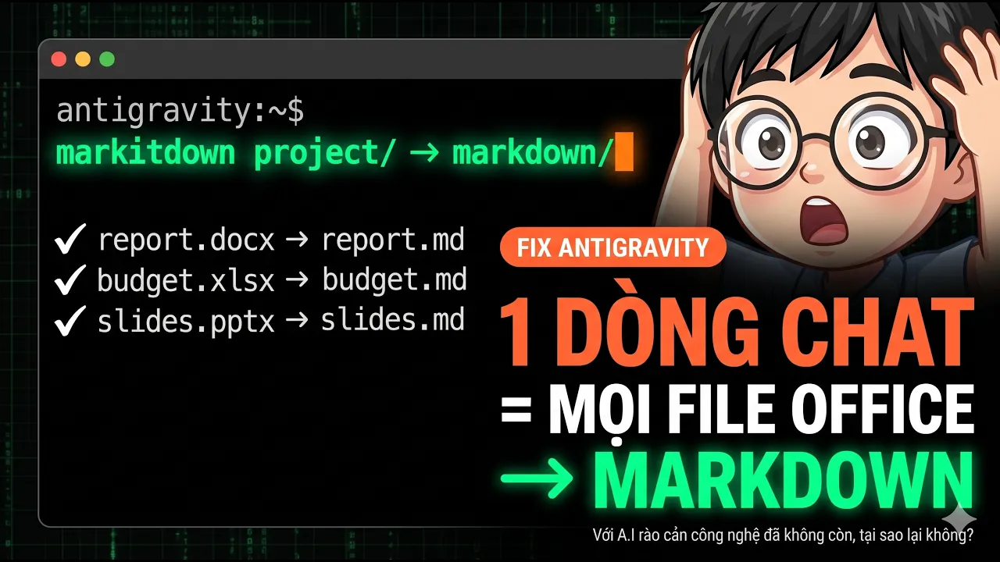
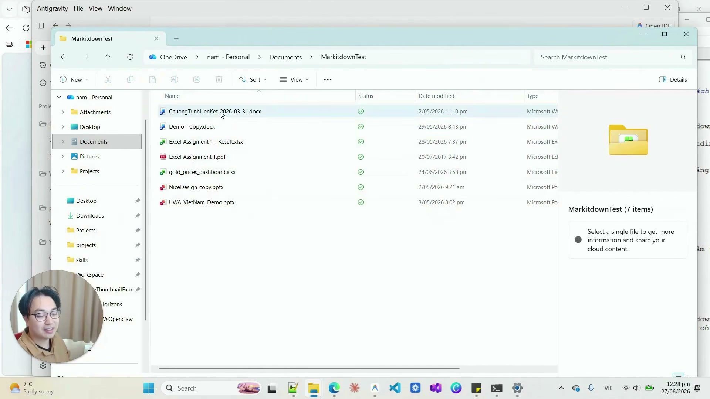

# Bài Đọc Thêm 12: Xử Lý Triệt Để Lỗi Không Mở Được File Office (.docx, .xlsx) Trong Antigravity

> 📺 **Nguồn Video tham khảo:** [Antigravity 2.0 Không Mở Được File Office? Đây Là Cách Fix Chỉ 1 Dòng](https://www.youtube.com/watch?v=5JnobuoKgQQ) (Thời lượng: 05:18 — Kênh PieLikeClaw)

---

## ❗ Nguyên Nhân Khiến Antigravity Báo Lỗi Khi Mở File Word, Excel

Khi mới bắt đầu sử dụng Antigravity, rất nhiều học viên bấm vào file Word (`.docx`) hoặc Excel (`.xlsx`) thì nhận được thông báo lỗi:
> *"The file is not displayed in the text editor because it is either binary or uses an unsupported text encoding."*

> 📸 *Ảnh chụp màn hình thực tế từ video: Lỗi phổ biến khi mở file nhị phân của Microsoft Office trên giao diện biên tập văn bản thuần.*

* **Nguyên nhân:** File Word, Excel, PowerPoint thực chất là các gói file nén nhị phân dạng ZIP, không phải là văn bản thuần túy như Markdown (`.md`) hay Text (`.txt`). Do đó trình đọc code cơ bản không thể hiển thị ký tự trực tiếp.

---

## 🛠️ Cách Sửa Nhanh Chỉ Trong 1 Bước (1 Click Hoặc 1 Dòng Lệnh)

> 📸 *Ảnh chụp màn hình thực tế từ video: Hướng dẫn cài đặt Extension hiển thị tài liệu Office trực tiếp ngay trong ứng dụng.*

### Cách 1: Cài Extension qua giao diện (Khuyên dùng cho Newbie)
1. Bấm tổ hợp phím **`Ctrl + Shift + X`** (trên Windows) hoặc **`Cmd + Shift + X`** (trên Mac).
2. Gõ tìm kiếm tiện ích **`Office Viewer`** và bấm **Install**.
3. Từ nay trở đi, bạn click chuột vào bất kỳ file `.docx`, `.xlsx` hay `.pptx` nào, màn hình sẽ hiển thị tài liệu đẹp mắt như trong MS Office!

### Cách 2: Nhờ AI cài đặt thư viện đọc dữ liệu ngầm
Nếu bạn muốn AI có thể tự đọc hiểu và trích xuất dữ liệu bên trong các file Excel/Word mà không cần hiển thị giao diện, chỉ cần gõ vào khung chat:
> *"Hãy cài đặt thư viện python-docx và openpyxl để xử lý file tài liệu Office cho tôi."*

AI sẽ tự động cấu hình môi trường trong vài giây và sẵn sàng xử lý mọi văn bản báo cáo cho bạn!
