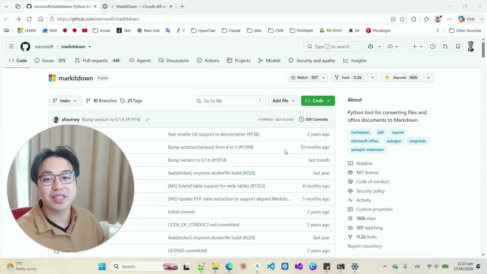
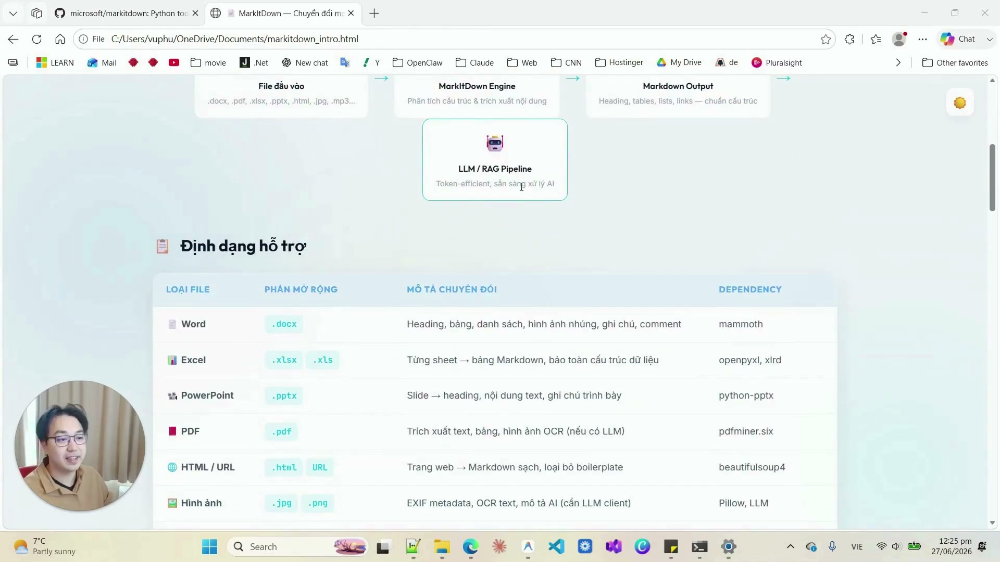
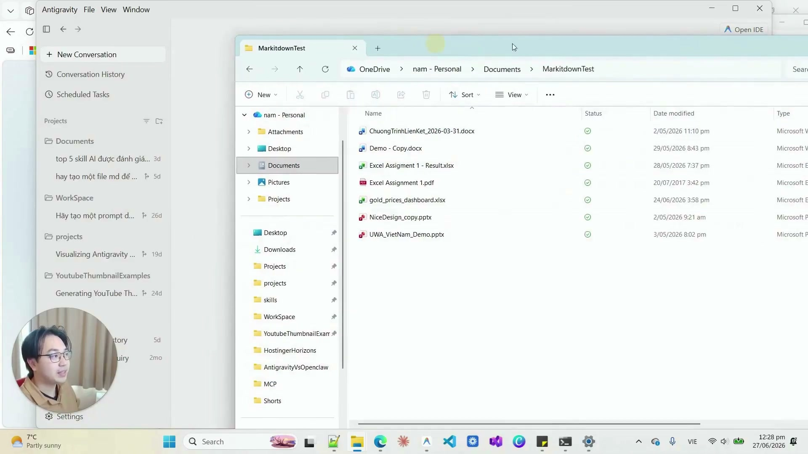
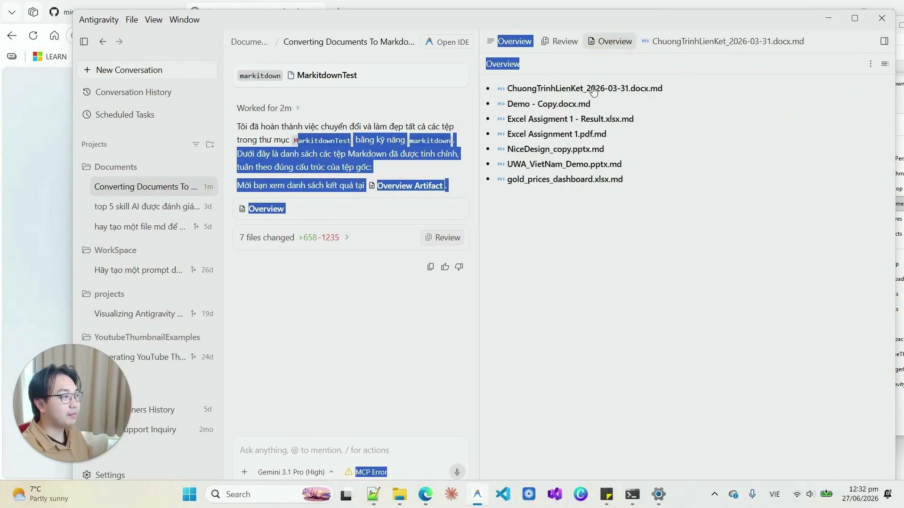

# Bài Đọc Thêm 12: Xử Lý Triệt Để Lỗi Không Mở Được File Office (.docx, .xlsx, .pptx, .pdf) Trong Antigravity Với Microsoft MarkItDown

> 📺 **Nguồn Video tham khảo:** [Antigravity 2.0 Không Mở Được File Office? Đây Là Cách Fix Chỉ 1 Dòng](https://www.youtube.com/watch?v=5JnobuoKgQQ) (Thời lượng: 05:18 — Kênh PieLikeClaw)


> 📸 *Ảnh chụp màn hình thực tế từ video (mốc 00:45): Thư viện mã nguồn mở Microsoft MarkItDown chuyên chuyển đổi tài liệu Office sang Markdown cho AI.*

---

## ❗ Nguyên Nhân Khiến Antigravity Báo Lỗi Khi Đọc File Office

Khi bạn ném các file Word (`.docx`), Excel (`.xlsx`), PowerPoint (`.pptx`) hay PDF vào Antigravity, LLM thường lúng túng hoặc báo lỗi file nhị phân (binary):
> *"The file is not displayed in the text editor because it is either binary or uses an unsupported text encoding."*

Nguyên nhân là cấu trúc tệp Office thực chất là các gói nén XML nhị phân. Để AI đọc và phân tích mượt mà, cách tối ưu nhất là chuyển đổi nội dung sang định dạng **Markdown thuần**.

---

## 🚀 Giải Pháp "1 Dòng Lệnh": Microsoft MarkItDown

Trong video, tác giả giới thiệu công cụ mã nguồn mở cực kỳ mạnh mẽ từ Microsoft mang tên **MarkItDown**.


> 📸 *Ảnh chụp màn hình thực tế từ video (mốc 01:40): Danh mục định dạng khổng lồ được MarkItDown hỗ trợ (PDF, Word, PowerPoint, Excel, Images qua EXIF/OCR, Audio qua Speech-to-Text, ZIP files).*

### Cài đặt siêu nhanh trong 1 dòng:
Chỉ cần mở Terminal trong Antigravity và chạy:
```bash
pip install markitdown
```

---

## 📂 Thực Chiến Trong Antigravity: Đọc Hàng Loạt File Đa Định Dạng

Chỉ cần ném các tệp tài liệu hỗn hợp (`.docx`, `.xlsx`, `.pptx`, `.pdf`, `.jpg`, `.mp3`) vào thư mục dự án của Antigravity:


> 📸 *Ảnh chụp màn hình thực tế từ video (mốc 03:20): Cấu trúc thư mục chứa cùng lúc Word, Excel, PowerPoint, PDF, Ảnh và Audio trong Antigravity 2.0.*

### Yêu cầu AI xử lý tự động:
Nhập prompt đơn giản cho Antigravity:
> *"Hãy dùng MarkItDown đọc toàn bộ các tài liệu trong thư mục này và tạo cho tôi một bản tóm tắt tổng quan (Overview Artifact) bằng tiếng Việt."*


> 📸 *Ảnh chụp màn hình thực tế từ video (mốc 03:55): Antigravity tự động trích xuất nội dung toàn bộ 7 file phức tạp và trình bày bảng tổng kết trực quan.*

### 💡 Lưu ý giá trị:
1. **Bảo mật cục bộ 100%:** MarkItDown xử lý hoàn toàn trên máy cục bộ, không gửi tài liệu ra bên ngoài.
2. **Hỗ trợ cả OCR và Transcribe:** Nếu kết hợp thêm Azure OpenAI hoặc Speech model, MarkItDown có thể mô tả cả biểu đồ trong ảnh và bóc băng file ghi âm cuộc họp.
