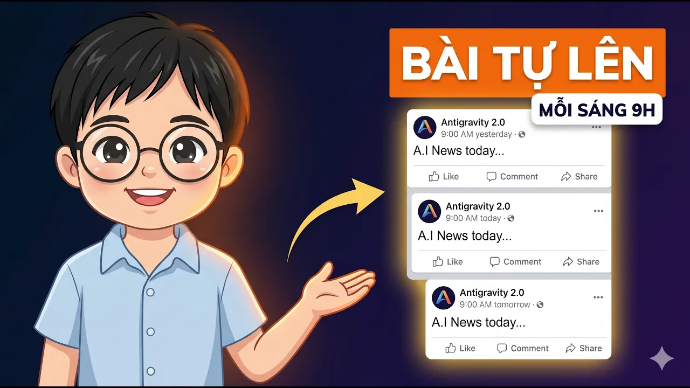

# Bài Đọc Thêm 13: Tự Động Hóa Hẹn Giờ Lên Lịch Đăng Bài Với Scheduled Tasks

> 📺 **Nguồn Video tham khảo:** [Không Cần Mở App, Antigravity 2.0 Vẫn Tự Đăng Facebook Cho Bạn Mỗi Ngày](https://www.youtube.com/watch?v=eo0rHohZTIk) (Thời lượng: 09:02 — Kênh PieLikeClaw)

---

## ⏰ Tính Năng Đột Phá: Scheduled Tasks (Tác Vụ Hẹn Giờ Tự Động)

Một trong những tính năng mạnh mẽ nhất của Antigravity 2.0 là **Scheduled Tasks**. 

Khác với các chatbot thụ động (chỉ làm việc khi con người gõ lệnh), Antigravity có thể **tự thức dậy theo đúng lịch hẹn hàng ngày**, tự động chạy một chuỗi công việc phức tạp và hoàn thành báo cáo hoặc đăng bài mà bạn không cần phải chạm tay vào bàn phím.

> 📸 *Ảnh chụp màn hình thực tế từ video: Tính năng Scheduled Tasks trong Antigravity 2.0 được cài đặt để tự kích hoạt vào 9:00 sáng mỗi ngày.*

---

## 🔄 Thị Phạm Chuỗi Quy Trình Tự Động 3 Bước: Cào Tin $
ightarrow$ Viết Bài $
ightarrow$ Đăng Lên Fanpage

> 📸 *Ảnh chụp màn hình thực tế từ video: Bài viết tiếng Việt và tiếng Anh được AI tự động tổng hợp từ tin tức mới nhất và đăng thẳng lên fanpage.*

Trong video, tác giả thị phạm chuỗi 3 Skill phối hợp nhịp nhàng:

1. **Bước 1 — Daily News Report Skill (Cào tin):** AI tự duyệt web tìm kiếm các sự kiện công nghệ và thị trường mới nhất trong 24 giờ qua, xuất ra một trang tin tóm tắt HTML.
2. **Bước 2 — Community Post Generator Skill (Viết bài):** Đọc bản tin trên và chấp bút thành một bài đăng Facebook cuốn hút bằng cả tiếng Việt và tiếng Anh.
3. **Bước 3 — Social Media Poster Skill (Tự động đăng bài):** Sử dụng Facebook Graph API để bắn trực tiếp bài viết lên Fanpage đúng 9:00 sáng mỗi ngày.

---

## 🎯 Giá Trị Thực Tế Cho Người Quản Lý & Marketing
* **Giải phóng thời gian tối đa:** Thiết lập quy trình một lần duy nhất, cỗ máy AI sẽ bền bỉ vận hành mỗi ngày.
* **Duy trì sự hiện diện liên tục:** Doanh nghiệp luôn có nội dung cập nhật đều đặn mà không tốn công sức làm thủ công hay sợ quên lịch đăng.
