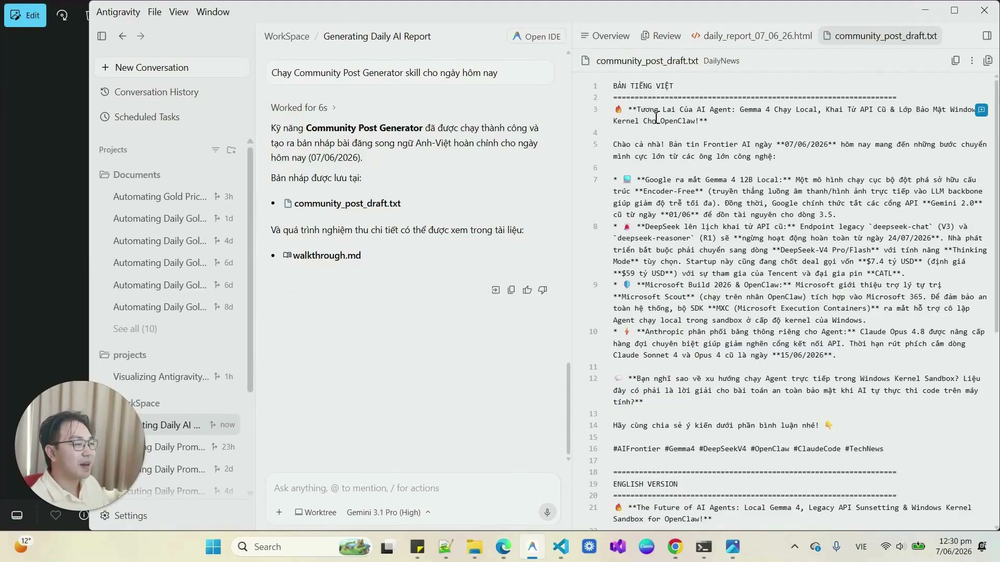
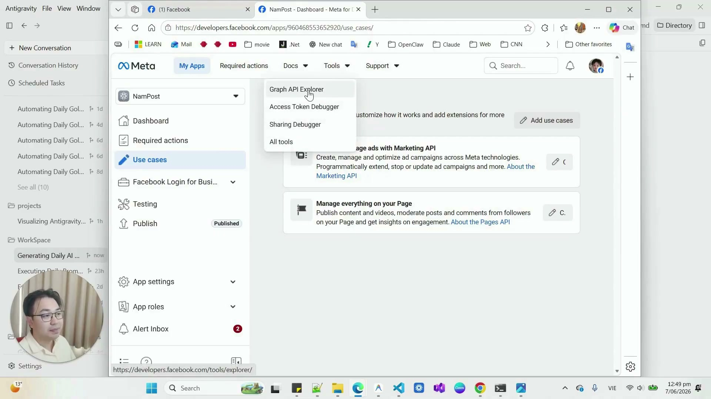

# Bài Đọc Thêm 13: Tự Động Hóa Hẹn Giờ Lên Lịch Đăng Bài Với Scheduled Tasks

> 📺 **Nguồn Video tham khảo:** [Không Cần Mở App, Antigravity 2.0 Vẫn Tự Đăng Facebook Cho Bạn Mỗi Ngày](https://www.youtube.com/watch?v=eo0rHohZTIk) (Thời lượng: 09:02 — Kênh PieLikeClaw)

> 📸 *Ảnh chụp màn hình thực tế từ video (mốc 01:12): Giao diện Scheduled Tasks (Ctrl+U) trong Antigravity 2.0 hiển thị các tác vụ nền tự động chạy hàng ngày.*

---

## ⏰ Tính Năng Đột Phá: Scheduled Tasks (Tác Vụ Hẹn Giờ Tự Động)

Một trong những tính năng mạnh mẽ nhất được Google giới thiệu tại sự kiện I/O 2026 trên Antigravity 2.0 là **Scheduled Tasks**. 

Khác với các chatbot thụ động (chỉ làm việc khi con người gõ lệnh), Antigravity có thể **tự thức dậy theo đúng lịch hẹn hàng ngày**, tự động chạy một chuỗi công việc phức tạp và hoàn thành báo cáo hoặc đăng bài mà bạn không cần phải mở app hay chạm tay vào bàn phím.

---

## 🔄 Thị Phạm Chuỗi Quy Trình Tự Động 3 Bước: Cào Tin ➔ Viết Bài ➔ Đăng Lên Fanpage

Trong video, tác giả thị phạm chuỗi 3 Skill phối hợp nhịp nhàng:

### Bước 1: Daily News Report Skill (Cào tin & Tổng hợp)
AI tự động duyệt web tìm kiếm các sự kiện công nghệ và thị trường mới nhất trong 24 giờ qua, xuất ra một trang tin tóm tắt HTML.

### Bước 2: Community Post Generator Skill (Viết bài)
Đọc bản tin trên và chấp bút thành một bài đăng Facebook cuốn hút bằng cả tiếng Việt và tiếng Anh.

> 📸 *Ảnh chụp màn hình thực tế từ video (mốc 02:35): File Artifact community_post_draft.txt được AI tạo tự động với bản tiếng Việt & tiếng Anh cùng các hashtag chuẩn chỉnh.*

### Bước 3: Cấu hình Meta Graph API & Cấp Token
Vào trang Meta for Developers để lấy Access Token với các quyền quản trị trang (`pages_manage_posts`, `pages_read_engagement`).

> 📸 *Ảnh chụp màn hình thực tế từ video (mốc 06:15): Thiết lập ứng dụng và cấp Access Token thông qua Graph API Explorer.*

---

## 🛠️ Thiết Lập Lịch Chạy Hàng Ngày Trong Scheduled Tasks

Nhấn vào nút `+ New` trong tab Scheduled Tasks để đặt tên, chọn giờ chạy (ví dụ `9:00 AM hàng ngày`) và cung cấp prompt điều phối chuỗi:

> 📸 *Ảnh chụp màn hình thực tế từ video (mốc 07:18): Form cấu hình tác vụ DailyPostFb tự động chạy đều đặn lúc 9:00 AM mỗi ngày.*

---

## 🎯 Kết Quả Đăng Tải Thực Tế Lên Facebook Fanpage

Sau khi đến giờ hẹn, Antigravity tự động thức dậy, thực thi trọn vẹn chuỗi tác vụ và đăng trực tiếp lên Facebook Fanpage mà không cần người dùng can thiệp:

> 📸 *Ảnh chụp màn hình thực tế từ video (mốc 08:10): Bài viết hoàn chỉnh được xuất bản trên Fanpage ("Published by NamPost • Just now") hoàn toàn tự động.*

### 💡 Giá Trị Thực Tế Cho Doanh Nghiệp:
* **Giải phóng thời gian tối đa:** Thiết lập quy trình một lần duy nhất, cỗ máy AI sẽ bền bỉ vận hành mỗi ngày.
* **Duy trì sự hiện diện liên tục:** Doanh nghiệp luôn có nội dung cập nhật đều đặn mà không tốn công sức làm thủ công hay sợ quên lịch đăng.
