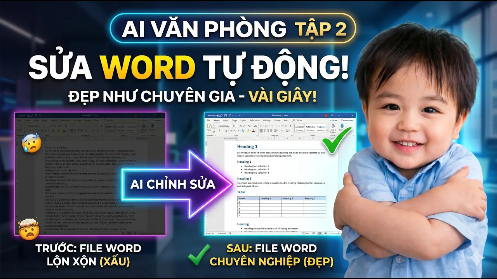
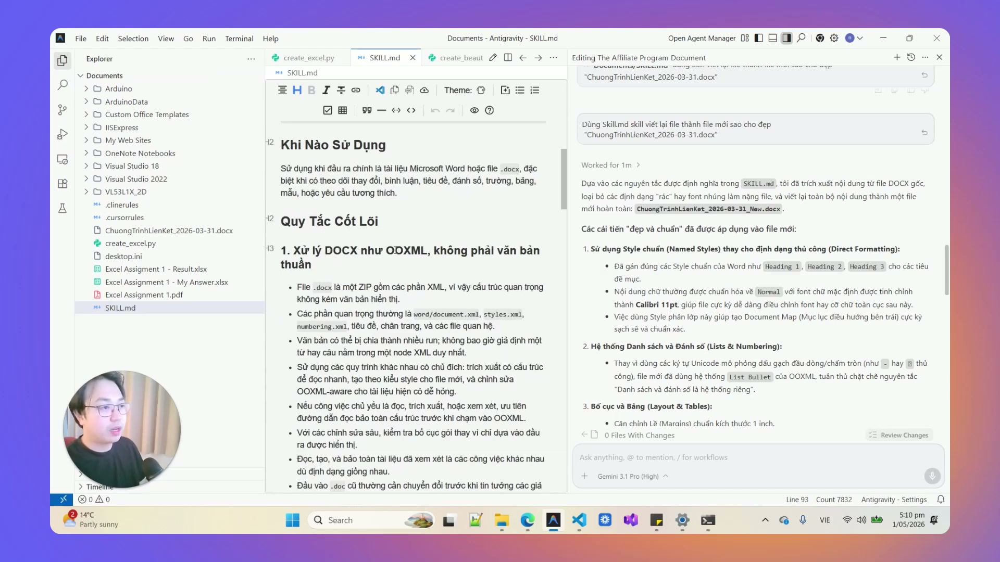
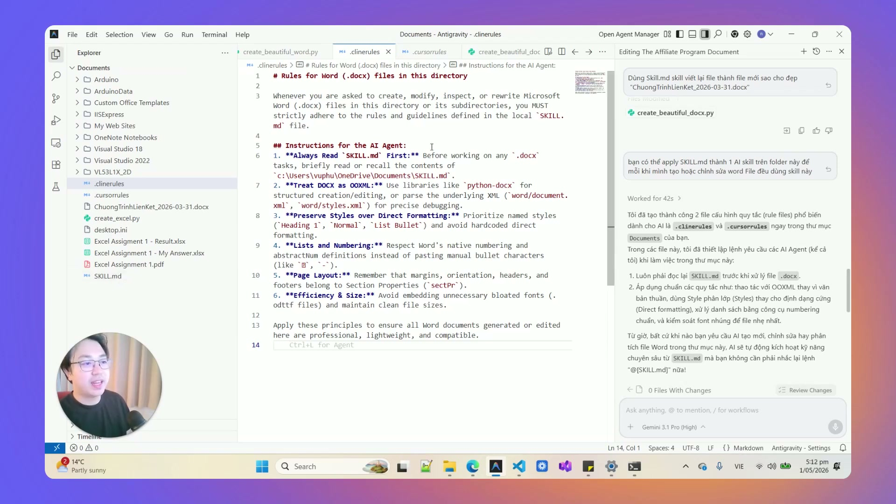

# Bài Đọc Thêm 14: Dạy AI Kỹ Năng Word — Tự Động Sửa Văn Bản Chuyên Nghiệp

> 📺 **Nguồn Video tham khảo:** [AI Văn Phòng #2: Dạy AI Kỹ Năng Word | Tự Động Sửa File Chuyên Nghiệp](https://www.youtube.com/watch?v=G6pkv8GEXGw) (Thời lượng: 05:24 — Kênh PieLikeClaw)

---

## 😫 Rủi Ro Khi Để AI Thông Thường Sửa File Word (.docx)

Nhiều người dùng copy nội dung file Word vào ChatGPT để nhờ chỉnh sửa, sau đó copy ngược lại thì gặp phải thảm họa định dạng:
* Mất toàn bộ hệ thống tiêu đề phân cấp (Heading 1, Heading 2).
* Bảng biểu (Tables) bị vỡ hàng cột, lệch lề.
* Mất chú thích cuối trang (Footnotes), số trang và mục lục tự động.

> 📸 *Ảnh chụp màn hình thực tế từ video: Cách cấu hình bộ kỹ năng chuyên gia (Word Skill) vào Antigravity để AI nắm vững các quy chuẩn trình bày văn bản.*

---

## 🛠️ Bộ Quy Tắc Sống Còn Khi Giao Việc Cho AI Với File Word

> 📸 *Ảnh chụp màn hình thực tế từ video: File Word sau khi được AI xử lý vẫn giữ nguyên phân cấp Heading, bảng biểu ngay ngắn và chuẩn văn phong.*

1. **Bảo tồn phân cấp tài liệu (Document Hierarchy):** AI phải giữ nguyên kiểu Heading chuẩn của Microsoft Word để tài liệu sau khi xuất ra vẫn tự động cập nhật được mục lục.
2. **Không làm vỡ bảng biểu:** Xử lý văn bản bên trong ô bảng mà không làm thay đổi độ rộng cột hoặc định dạng viền có sẵn.
3. **Quy tắc làm việc an toàn:** Luôn yêu cầu AI xuất ra một bản sao mới (Ví dụ: `Bao_Cao_Tinh_Chinh.docx`) thay vì ghi đè trực tiếp lên tệp tài liệu gốc.
