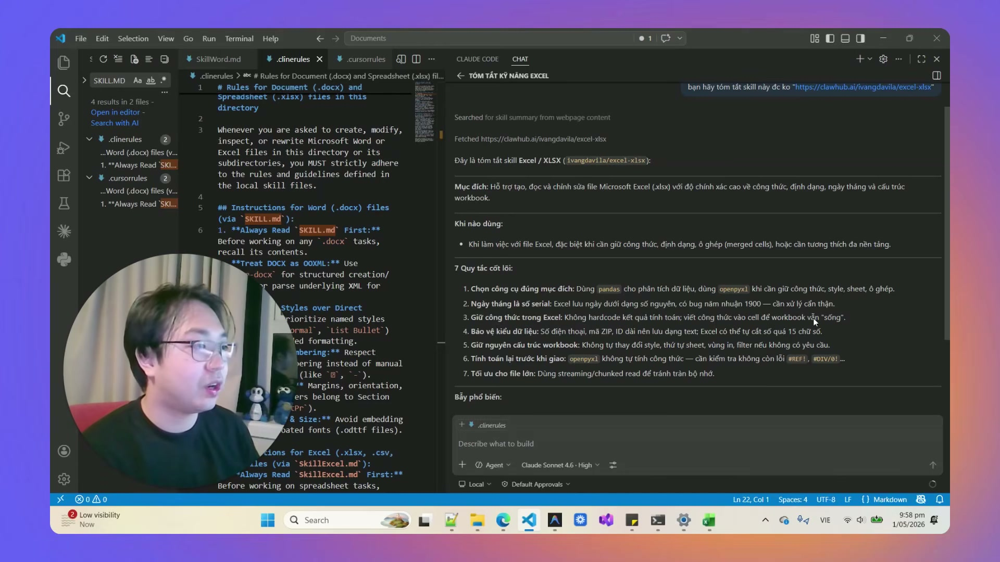
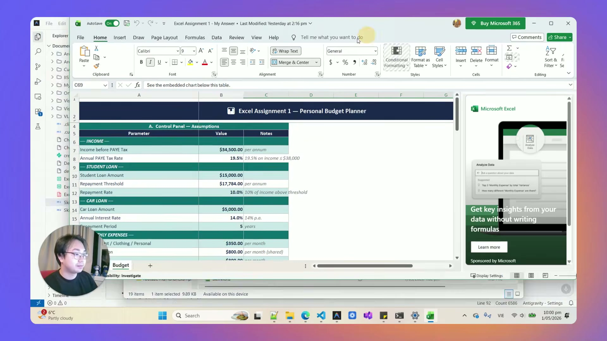

# Bài Đọc Thêm 15: Excel Skill Cho AI — Tự Động Sửa Lỗi Công Thức & Chuẩn Hóa Bảng Tính

> 📺 **Nguồn Video tham khảo:** [AI Văn Phòng #3: Excel Skill Cho AI | Tự Động Sửa Lỗi & Định Dạng](https://www.youtube.com/watch?v=BPhJifuAFps) (Thời lượng: 06:13 — Kênh PieLikeClaw)

---

## ⚠️ 7 "Cái Bẫy" Chết Người Khi Để AI Thao Tác Với Excel

Khi xử lý các file bảng tính Excel chứa hàng nghìn dòng dữ liệu, nếu không có bộ kỹ năng ràng buộc, AI rất dễ mắc các sai lầm nghiêm trọng:

> 📸 *Ảnh chụp màn hình thực tế từ video: AI tự động quét và phân biệt giữa lỗi công thức, ô bị nhập cứng (hardcode) và dữ liệu thiếu sót.*

1. **Chuyển công thức sống thành số chết (Hardcode):** Thay vì giữ hàm tính toán (`=SUM(C2:C50)`), AI lại tự gõ số kết quả cứng vào ô, làm mất tính năng tự động nhảy số của bảng tính.
2. **Cắt cụt số dài trên 15 chữ số:** Các số tài khoản ngân hàng, mã số thuế, mã định danh nếu không được định dạng kiểu `Text` sẽ bị Excel tự động làm tròn hoặc chuyển thành dạng khoa học (`1.23E+11`).
3. **Phá vỡ vùng in (Print Area) & Bộ lọc (Filter):** Làm mất các thiết lập xem và in ấn mà kế toán/nhân sự đã dày công tạo trước đó.

---

## 🚀 Đóng Gói Bộ Kỹ Năng Excel Vào Antigravity

> 📸 *Ảnh chụp màn hình thực tế từ video: File Excel được tối ưu lại công thức, định dạng cột rõ ràng và khắc phục triệt để các lỗi hiển thị.*

* **Cách thức:** Nạp tệp quy tắc `excel_skill.md` vào thư mục dự án của Antigravity.
* **Quy trình hoạt động:** Mỗi khi bạn yêu cầu AI tính toán hoặc chỉnh sửa file Excel, Antigravity sẽ tự động đọc bộ quy tắc này trước để:
  * Viết đúng cú pháp hàm Excel.
  * Giữ nguyên cấu trúc các Sheet liên kết.
  * Tự động căn chỉnh độ rộng cột và tô màu xen kẽ giúp bảng tính dễ nhìn.
