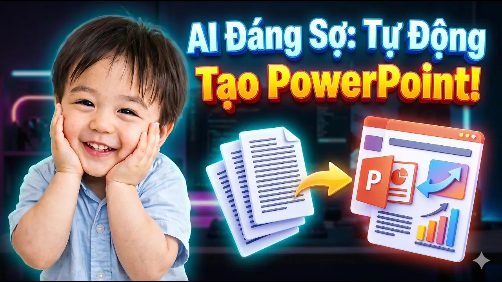
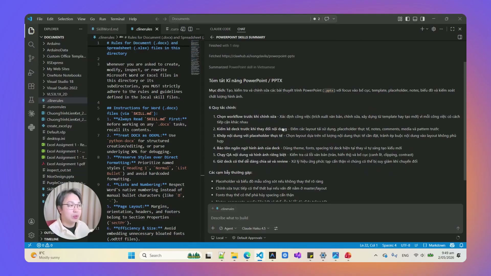

# Bài Đọc Thêm 16: Đánh Giá Thực Tế AI Tự Làm Slide PowerPoint Từ Tài Liệu Văn Bản

> 📺 **Nguồn Video tham khảo:** [AI Văn Phòng #4: AI Tự Làm PowerPoint Từ Tài Liệu | Kết Quả Thực Tế Ra Sao?](https://www.youtube.com/watch?v=GBQ_zLMlGeI) (Thời lượng: 05:16 — Kênh PieLikeClaw)

---

## 🎯 Thử Nghiệm Thực Tế: Biến Tài Liệu Dài Hàng Trang Thành Slide Báo Cáo

Tình huống phổ biến tại công sở: Sếp gửi cho bạn một văn bản đề án dài 10 trang và yêu cầu: *"Chiều nay chuẩn bị cho anh một bài trình chiếu 7-8 slide để báo cáo cuộc họp"*.

> 📸 *Ảnh chụp màn hình thực tế từ video: Giao file văn bản cho AI và kích hoạt quy trình tự động trích xuất các ý chính sang slide PowerPoint.*

---

## 🔍 Ưu Điểm & Giới Hạn Cần Lưu Ý Khi AI Tự Sinh Slide

> 📸 *Ảnh chụp màn hình thực tế từ video: Slide do AI tạo tự động tóm tắt cực tốt nội dung nhưng cần kết hợp template có sẵn để đạt tính thẩm mỹ cao.*

### 1. Điểm mạnh vượt trội:
* **Tốc độ bóc tách thông tin:** Chỉ trong 30 giây, AI đọc xong toàn bộ văn bản và chia đều nội dung vào từng slide theo mạch logic rõ ràng (Mục tiêu $
ightarrow$ Vấn đề $
ightarrow$ Giải pháp $
ightarrow$ Kết quả mong đợi).
* **Tiết kiệm 80% công sức:** Bạn không cần phải ngồi đọc từng đoạn và copy từng dòng chữ sang PowerPoint.

### 2. Điểm cần cải thiện & Giải pháp:
* **Thiết kế mặc định còn đơn giản:** Nếu không cung cấp mẫu có sẵn, slide do AI tạo sẽ chủ yếu là chữ và các gạch đầu dòng cơ bản.
* **Lời khuyên ứng dụng:** Hãy kết hợp bài học này với **[Bài Đọc Thêm 10](Bai_Doc_10_Tu_Dong_Tao_Slide_PowerPoint_Theo_Mau_Doanh_Nghiep.md)**: Đưa sẵn tệp Slide Master của công ty làm khuôn mẫu, AI sẽ tự động gắn nội dung đã tóm tắt vào đúng thiết kế nhận diện thương hiệu hoàn hảo!
