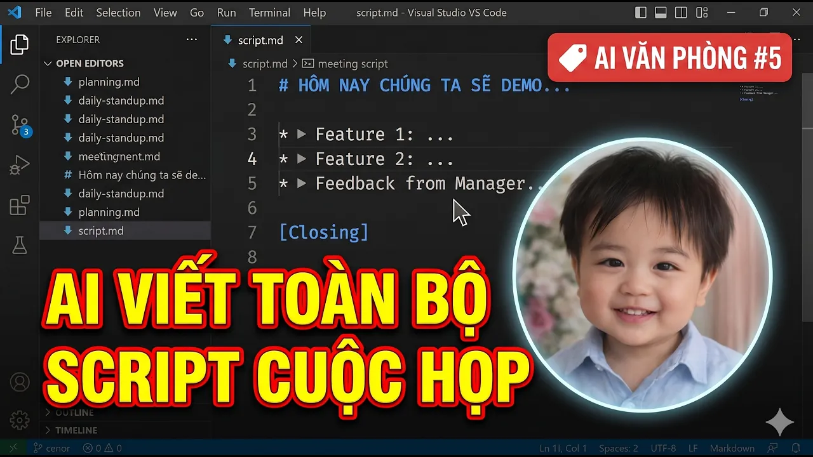

# Bài Đọc Thêm 17: AI Tự Soạn Kịch Bản Mọi Cuộc Họp — Xây Dựng Scrum Master & Meeting Agent

> 📺 **Nguồn Video tham khảo:** [AI Văn Phòng #5: AI Tự Viết Script Cho Mọi Cuộc Họp | Scrum Master Agent](https://www.youtube.com/watch?v=xLehvqex9gc) (Thời lượng: 09:04 — Kênh PieLikeClaw)

---

## 😫 Áp Lực "Họp Triền Miên" Của Người Quản Lý & Điều Phối

Trong môi trường doanh nghiệp hiện đại, những người làm quản lý, Scrum Master hay Project Manager (PM) thường phải chủ trì hàng chục cuộc họp mỗi tuần:
* **Daily Standup:** Họp nhanh đầu ngày 15 phút.
* **Sprint Planning:** Lập kế hoạch 2 tuần cho toàn đội ngũ.
* **Sprint Demo / Showcase:** Trình diễn sản phẩm cho Ban giám đốc & Stakeholders.
* **Retrospective (Họp rút kinh nghiệm):** Nhìn nhận việc làm tốt & chưa tốt.
* **PI Planning:** Lập kế hoạch chiến lược 3 tháng.

Chuẩn bị kịch bản dẫn dắt (Facilitation Script), đặc biệt là các cuộc họp bằng tiếng Anh với lãnh đạo nước ngoài, thường tiêu tốn hàng giờ đồng hồ và gây căng thẳng tâm lý.

> 📸 *Ảnh chụp màn hình thực tế từ video: Đóng gói các quy chuẩn Scrum Guide thành biểu mẫu Agent để AI hiểu sâu từng loại cuộc họp.*

---

## 🤖 Giải Pháp: Xây Dựng Meeting Facilitator Agent Trong Antigravity

Thay vì tự ngồi vắt óc soạn kịch bản mỗi sáng, bạn chỉ cần nạp bộ quy tắc điều phối vào Antigravity và để AI tự động hóa việc này:

> 📸 *Ảnh chụp màn hình thực tế từ video: Kịch bản điều phối cuộc họp Demo sản phẩm được AI sinh ra chi tiết từ lời chào, chuyển tiếp người nói đến phần hỏi đáp.*

### Cấu trúc 5 phần của một Kịch bản Cuộc họp Chuẩn:
1. **Opening (Chào mừng & Giới thiệu bối cảnh):** Lời chào lịch sự, nêu rõ mục tiêu cuộc họp và cảm ơn các bên liên quan đã dành thời gian.
2. **Sprint Highlights (Tổng kết thành tựu):** Tóm tắt nhanh những hạng mục quan trọng đã hoàn thành trong kỳ.
3. **Showcase Transitions (Dẫn dắt thuyết trình):** Lời chuyển giao mạch lạc giữa các thành viên lên trình bày từng tính năng/kết quả.
4. **Stakeholder Feedback (Thu thập phản hồi):** Đặt câu hỏi gợi mở để Lãnh đạo và các bên liên quan góp ý mang tính xây dựng.
5. **Action Items & Closing (Tổng kết & Giao việc):** Chốt lại các việc cần làm tiếp theo, rủi ro cần phòng ngừa và kết thúc cuộc họp đúng giờ.

---

## 💡 Bài Học Thực Chiến Cho Dân Công Sở
* **Chỉ mất 3 phút trước giờ G:** Bạn chỉ cần gõ `@Scrum_Master_Prep [Loại cuộc họp]`, AI sẽ xuất ngay một kịch bản song ngữ (Việt - Anh) sắc sảo để bạn tự tin làm chủ phòng họp.
* **AI là "chiếc phao cứu sinh" về ngôn ngữ:** Giúp người không giỏi tiếng Anh tự tin dẫn dắt các cuộc họp quốc tế chuyên nghiệp mà không còn nỗi sợ "nói vấp hay bí từ".
