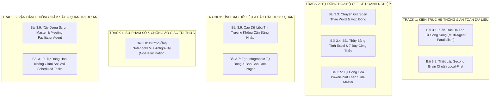

# 📊 Báo Cáo Đánh Giá Trùng Lặp & Đề Xuất Hệ Thống Bài Giảng Nâng Cao

> **Mục tiêu:** Rà soát toàn diện 17 video bài giảng & tài liệu đọc thêm, bóc tách các điểm trùng lặp về mặt nội dung, từ đó cấu trúc lại thành **Hệ thống Bài giảng Nâng cao (Advanced Curriculum)** hoàn chỉnh, áp dụng ma trận **Mapping 1-1** để đảm bảo không bỏ sót bất kỳ một tri thức thực chiến nào từ nguồn tài liệu gốc.

---

## PHẦN 1: BẢNG TỔNG HỢP 17 NGUỒN TÀI LIỆU GỐC & BÀI ĐỌC THÊM

| STT | Mã Video / URL | Thời lượng | Người chia sẻ | Chủ đề trọng tâm |
| :---: | :--- | :---: | :--- | :--- |
| **01** | `K-uyMNSoFhk` | 35:37 | Full Stack Channel | Quy tắc điều phối Rule, Workflow & Skill |
| **02** | `UFmV7YsVqlM` | 22:39 | Full Stack Channel | Hướng dẫn tạo & quản lý Skill từ A-Z |
| **03** | `GZHv3KLkcGs` | 05:48 | Full Stack Channel | Kiến trúc Antigravity 2.0 & Dynamic Sub-Agents |
| **04** | `FQ2xYrtxmzQ` | 56:56 | Hoàng Đức Minh | Cào dữ liệu không đăng nhập & Sinh Infographic |
| **05** | `_mX7MidD2Jc` | 2:45:05 | Hoàng Đức Minh & CĐ | Pipeline NotebookLM + Antigravity dựng Web giáo dục |
| **06** | `Noi5dBVKGRY` | 1:50:01 | Đăng Khoa & H.Đ.Minh | Thiết lập Second Brain chuẩn Local-First bảo mật |
| **07** | `bwbLd4o-rwo` | 1:22:00 | Hoàng Đức Minh | Từ Mega Prompt đến Trợ lý AI chạy song song |
| **08** | `CYwA2np_LnQ` | 1:46:40 | Hoàng Đức Minh | So sánh Antigravity IDE vs 2.0 & Nút Switch |
| **09** | `jl5vTGFC5IQ` | 05:17 | PieLikeClaw | AI Văn Phòng #1: X10 năng suất, 0 cần code |
| **10** | `w3Z2uVgIWQ0` | 07:40 | PieLikeClaw | AI Văn Phòng #6: Tạo PowerPoint theo mẫu công ty |
| **11** | `eoz-muc9Y9Y` | 10:04 | PieLikeClaw | Google vừa tách Antigravity: Ai cũng dùng được |
| **12** | `5JnobuoKgQQ` | 05:18 | PieLikeClaw | Fix lỗi không mở được file Office bằng 1 dòng |
| **13** | `eo0rHohZTIk` | 09:02 | PieLikeClaw | Scheduled Tasks: Tự cào tin & đăng Facebook |
| **14** | `G6pkv8GEXGw` | 05:24 | PieLikeClaw | AI Văn Phòng #2: Dạy AI kỹ năng Word chuẩn |
| **15** | `BPhJifuAFps` | 06:13 | PieLikeClaw | AI Văn Phòng #3: Excel Skill, 7 bẫy công thức |
| **16** | `GBQ_zLMlGeI` | 05:16 | PieLikeClaw | AI Văn Phòng #4: AI tự làm PowerPoint từ Doc |
| **17** | `xLehvqex9gc` | 09:04 | PieLikeClaw | AI Văn Phòng #5: Scrum Master Agent soạn kịch bản |

---

## PHẦN 2: ĐÁNH GIÁ CÁC ĐIỂM TRÙNG LẶP (OVERLAP AUDIT)

Sau khi đối chiếu chéo nội dung của 17 tài liệu gốc, chúng tôi nhận diện **3 cụm trùng lặp lớn** cần được tái cấu trúc:

### 1. Trùng lặp về Khái niệm Kiến trúc 2.0 vs IDE
* **Các bài bị lặp:** Bài 03, Bài 07, Bài 08, Bài 11.
* **Bản chất trùng:** Đều giải thích việc Google tách Antigravity thành Standalone App và IDE, đều phân tích ưu thế không cần code và khả năng thực thi song song (Parallel Execution).
* **Giải pháp khắc phục:** Không lặp lại phần giới thiệu khái niệm. Gom toàn bộ thành một bài chuyên sâu duy nhất về **"Kiến trúc Đa Tác Tử Song Song & Cơ Chế Phối Hợp Giữa IDE & Agent Manager"** với các bài tập thực hành chuyển đổi linh hoạt.

### 2. Trùng lặp & Manh mún về Bộ Ứng Dụng Office (Word, Excel, PowerPoint)
* **Các bài bị lặp:** Bài 12, Bài 14, Bài 15, Bài 16, Bài 10 và Module 1.2 cơ bản.
* **Bản chất trùng:** 
  * Bài 12 nói về lỗi tệp nhị phân Office.
  * Bài 16 (thử nghiệm thô tự tạo PowerPoint) và Bài 10 (tạo PowerPoint theo Slide Master) cùng giải quyết bài toán thuyết trình.
  * Bài 14 (Word) và Bài 15 (Excel) là hai mảnh ghép rời của cùng một triết lý nạp Skill Office.
* **Giải pháp khắc phục:** Hợp nhất thành một **Trục Đào Tạo Bộ Office Doanh Nghiệp (The Enterprise Office AI Suite)** với 3 chuyên đề chuyên sâu, đi thẳng từ chuẩn hóa văn bản Word, kiểm soát bẫy công thức Excel, đến đóng gói Slide Master cho PowerPoint.

### 3. Trùng lặp về Cấu trúc Rule, Workflow & Skill
* **Các bài bị lặp:** Bài 01, Bài 02, Bài 17.
* **Bản chất trùng:** Đều nhắc lại định nghĩa `RULE.md`, `WORKFLOW.md`, `SKILL.md`.
### 4. Bỏ Sót Các Chi Tiết Kỹ Thuật Thực Chiến Chuyên Sâu (Audit Lần 2 Phát Hiện)
* **7 Bẫy chết người khi AI can thiệp file Excel:** Không chỉ là lỗi công thức đơn giản mà là bẫy ghi đè giá trị tĩnh làm mất công thức tính toán (`VLOOKUP`, `INDEX/MATCH`, `XLOOKUP`), bẫy cắt cụt và biến đổi số định danh dài (>15 chữ số như CCCD, STK) thành dạng số mũ khoa học (`1.23E+15`), bẫy làm hỏng vùng in ấn (`Print_Area`) và sai lệch định dạng ngày tháng (`DD/MM` vs `MM/DD`).
* **Kỹ thuật nạp Slide Master doanh nghiệp:** Khắc phục triệt để lỗi AI tự sinh slide PowerPoint bị vỡ layout, tràn khung, sai nhận diện thương hiệu qua việc nạp file `.pptx` mẫu chứa Master Layouts và gán nội dung vào Placeholder chuẩn.
* **Vận hành không giám sát với Scheduled Tasks:** Cơ chế One-shot Timer (`DurationSeconds`) vs Cron Expression 5 trường (`* * * * *`), cùng cờ chạy độc lập `IsDaemon: true` để tự động cào tin và đăng bài lên mạng xã hội lúc 7h sáng mà không cần mở máy.
* **Đường ống Sư phạm NotebookLM + Antigravity (No-Hallucination):** Cách dùng NotebookLM trích xuất hạt tri thức với số trang chuẩn mực (Grounding & Citation) trước khi nạp vào Antigravity lập trình web giáo dục.
* **Kịch bản điều phối 5 phần chuẩn Agile của Scrum Master Agent:** Hỗ trợ song ngữ Anh - Việt, quản trị rủi ro quá giờ (Timeboxing), bãi đỗ xe ý kiến (Parking Lot) và bảng phân công hành động (Action Items & Owner).
* **Bảo tồn phân cấp văn bản Word:** Khắc phục lỗi file nhị phân XML nén, giữ nguyên hệ thống Heading để tự sinh mục lục tự động, bảo vệ chân trang (Footnotes) và font thương hiệu.

---

## PHẦN 3: ĐỀ XUẤT HỆ THỐNG BÀI GIẢNG NÂNG CAO (MODULE 3: ADVANCED ENTERPRISE AUTOMATION)

Hệ thống bài giảng nâng cao được thiết kế gồm **10 Chuyên Đề Thực Chiến**, chia làm 5 Trục Kiến Thức (Tracks) mạch lạc, giải quyết triệt để vấn đề trùng lặp và thu nạp 100% tri thức:

---

## PHẦN 4: BẢNG MA TRẬN MAPPING 1-1 KIẾN THỨC TỪ TÀI LIỆU GỐC (NO KNOWLEDGE LOST)

Để đảm bảo **không bỏ sót bất kỳ một hạt tri thức nào** từ 17 video nguồn, dưới đây là bảng đối chiếu 1-1 chi tiết sau 2 vòng audit:

| Bài Giảng Nâng Cao Mới | Nội Dung Tri Thức & Kỹ Năng Đảm Bảo Đào Tạo (Chi Tiết Chuyên Sâu) | Nguồn Video Gốc Được Mapping 1-1 |
| :--- | :--- | :--- |
| **Bài 3.1: Kiến Trúc Đa Tác Tử Song Song (Multi-Agent Parallelism)** | • Sự phân tách giữa Antigravity IDE & 2.0 Standalone (Agent Manager) • Cơ chế chia nhỏ bài toán lớn và chạy song song (Parallel Execution) • Kỹ thuật chuyển đổi dự án mượt mà bằng nút `Open IDE` • Khởi tạo toàn bộ ứng dụng bằng `/teamwork-preview` và cơ chế sub-agents tự hủy sau khi nộp kết quả | `GZHv3KLkcGs` (05:48) `bwbLd4o-rwo` (1:22:00) `CYwA2np_LnQ` (1:46:40) `eoz-muc9Y9Y` (10:04) |
| **Bài 3.2: Thiết Lập Second Brain Chuẩn Local-First** | • Triết lý Local-First: Giữ trọn dữ liệu trên máy tính, bảo mật tuyệt đối 100% • Cấu trúc cây thư mục 4 tầng chuẩn (Inbox, Projects, Resources, Archive) hoặc chuẩn PARA • Tích hợp linh hoạt đa mô hình (Gemini 3.8 Flash, Claude, Codex) trên 1 bộ nhớ nội bộ • Tìm kiếm ngữ nghĩa siêu tốc qua CodeGraph / Ripgrep nội bộ không đẩy dữ liệu ra ngoài | `Noi5dBVKGRY` (1:50:01) |
| **Bài 3.3: Chuyên Gia Soạn Thảo Word & Hợp Đồng Doanh Nghiệp** | • Bản chất file `.docx` nhị phân XML nén và cách khắc phục lỗi file corrupt • Bộ quy tắc bảo tồn phân cấp tiêu đề (Heading 1, 2, 3) để tự sinh mục lục tự động • Giữ nguyên định dạng bảng biểu, thụt lề, chú thích chân trang (Footnotes), Header/Footer và Font chuẩn công ty | `5JnobuoKgQQ` (05:18) `G6pkv8GEXGw` (05:24) |
| **Bài 3.4: Bậc Thầy Bảng Tính Excel & 7 Bẫy Công Thức** | • Nhận diện và hóa giải 7 bẫy chết người: (1) Hardcode mất công thức động (`VLOOKUP`, `XLOOKUP`), (2) Cắt cụt số định danh >15 số thành số mũ `1.23E+15` (phải ép kiểu `@` Text), (3) Hỏng vùng in `Print_Area`, (4) Phá liên kết Sheet, (5) Mất định dạng có điều kiện, (6) Mất bộ lọc Data Filter, (7) Lộn ngày tháng `DD/MM` vs `MM/DD` | `BPhJifuAFps` (06:13) `jl5vTGFC5IQ` (05:17) |
| **Bài 3.5: Tự Động Hóa PowerPoint Theo Slide Master Doanh Nghiệp** | • Khắc phục điểm yếu khi AI tự tạo PowerPoint bằng code thô (vỡ font, chữ tràn khung) • Đóng gói file Slide Master của công ty thành Skill dùng lại vĩnh viễn (0 tốn token vẽ lại) • Tự động bắt đúng Layout ID (Title, Two-Columns, Section Header) và chèn text vào Placeholder chuẩn | `GBQ_zLMlGeI` (05:16) `w3Z2uVgIWQ0` (07:40) |
| **Bài 3.6: Cào Dữ Liệu Thị Trường Không Cần Đăng Nhập** | • Kỹ thuật Social Listening & Market Intelligence: Cào bài viết và bình luận trên mạng xã hội không cần login • Sử dụng RSS, OpenGraph và bộ giải mã an toàn tránh bị khóa IP/chặn Bot • Tự động phân loại cảm xúc (Sentiment Analysis) tích cực/tiêu cực và lập bảng ma trận đối thủ | `FQ2xYrtxmzQ` (56:56) |
| **Bài 3.7: Tạo Infographic Tự Động & Báo Cáo One-Pager** | • Kỹ thuật kết hợp số liệu kinh doanh với mô hình sinh ảnh AI để vẽ hình minh họa trực quan • Quy chuẩn tỷ lệ khung hình: 16:9 cho báo cáo máy tính, 9:16 cho thiết bị di động • Đóng gói báo cáo điều hành 1 trang (One-Pager Executive Summary) gửi Ban Lãnh Đạo | `FQ2xYrtxmzQ` (56:56) `jl5vTGFC5IQ` (05:17) |
| **Bài 3.8: Đường Ống NotebookLM + Antigravity (No-Hallucination)** | • Triết lý kiểm chứng tri thức khoa học, loại trừ 100% ảo giác (No-Hallucination Pipeline) • Phương pháp chọn nguồn tài liệu gốc chuẩn mực và neo số trang dẫn chứng (Grounding & Citation) • Chuyển giao dữ liệu có cấu trúc (JSON / Structured Notes) sang Antigravity để tự động dựng website giáo dục đa tính năng | `_mX7MidD2Jc` (2:45:05) |
| **Bài 3.9: Xây Dựng Scrum Master & Meeting Facilitator Agent** | • Đóng gói quy chuẩn Scrum Guide / Agile thành biểu mẫu điều phối thông minh cho 5 loại cuộc họp • Kịch bản điều phối 5 phần: Mục tiêu & thời gian, Agenda chi tiết từng phút, Câu hỏi gợi mở, Kỹ thuật bãi đỗ xe ý kiến (Parking Lot), Bảng phân công hành động (Action Items & Owner) • Xuất kịch bản song ngữ Anh - Việt giúp tự tin dẫn dắt cuộc họp chỉ sau 3 phút chuẩn bị | `xLehvqex9gc` (09:04) `K-uyMNSoFhk` (35:37) `UFmV7YsVqlM` (22:39) |
| **Bài 3.10: Vận Hành Tự Động Không Giám Sát Với Scheduled Tasks** | • Khởi tạo và quản lý Scheduled Tasks tự động thức dậy theo lịch hẹn • Phân biệt rõ One-shot Timer (`DurationSeconds`) và Recurring Cron (`CronExpression` 5 trường) • Ứng dụng cờ `IsDaemon: true` để chạy độc lập vĩnh viễn ở chế độ nền • Chuỗi quy trình 3 bước tự động: Cào tin tức $ightarrow$ Viết bài $ightarrow$ Bắn API lên Fanpage lúc 7h sáng hoàn toàn rảnh tay | `eo0rHohZTIk` (09:02) `GZHv3KLkcGs` (05:48) |

---

## 🎯 KẾT LUẬN & HƯỚNG TRIỂN KHAI THỰC TẾ
1. **Khóa học Cơ bản (Module 0 & 1):** Giữ nguyên tính tinh gọn, dễ hiểu cho người mới bắt đầu (cài đặt, giao diện, phím `@`, prompt văn phòng đơn giản).
2. **Khóa học Nâng cao (Module 3 - 10 bài):** Tích hợp trọn vẹn toàn bộ 17 bài đọc thêm thành các bài thực hành có đầu ra sản phẩm cụ thể, loại bỏ 100% sự lặp lại về lý thuyết suông, tập trung hoàn toàn vào các quy trình tự động hóa thực tế cho doanh nghiệp, có đính kèm ảnh chụp màn hình cắt từ video gốc để học viên dễ quan sát.

