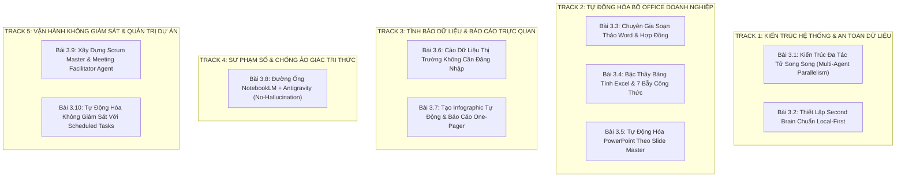

# 📊 Báo Cáo Đánh Giá Trùng Lặp & Đề Xuất Hệ Thống Bài Giảng Nâng Cao

> **Mục tiêu:** Rà soát toàn diện 17 video bài giảng & tài liệu đọc thêm, bóc tách các điểm trùng lặp về mặt nội dung, từ đó cấu trúc lại thành **Hệ thống Bài giảng Nâng cao (Advanced Curriculum)** hoàn chỉnh, áp dụng ma trận **Mapping 1-1** để đảm bảo không bỏ sót bất kỳ một tri thức thực chiến nào từ nguồn tài liệu gốc.

---

## PHẦN 1: BẢNG TỔNG HỢP 17 NGUỒN TÀI LIỆU GỐC & BÀI ĐỌC THÊM

| STT | Mã Video / URL | Thời lượng | Người chia sẻ | Chủ đề trọng tâm |
| :---: | :--- | :---: | :--- | :--- |
| **01** | `K-uyMNSoFhk` | 35:37 | Full Stack Channel | Quy tắc điều phối Rule, Workflow & Skill |
| **02** | `UFmV7YsVqlM` | 22:39 | Full Stack Channel | Hướng dẫn tạo & quản lý Skill từ A-Z |
| **03** | `GZHv3KLkcGs` | 05:48 | Full Stack Channel | Kiến trúc Antigravity 2.0 & Dynamic Sub-Agents |
| **04** | `FQ2xYrtxmzQ` | 56:56 | Hoàng Đức Minh | Cào dữ liệu không đăng nhập & Sinh Infographic |
| **05** | `_mX7MidD2Jc` | 2:45:05 | Hoàng Đức Minh & CĐ | Pipeline NotebookLM + Antigravity dựng Web giáo dục |
| **06** | `Noi5dBVKGRY` | 1:50:01 | Đăng Khoa & H.Đ.Minh | Thiết lập Second Brain chuẩn Local-First bảo mật |
| **07** | `bwbLd4o-rwo` | 1:22:00 | Hoàng Đức Minh | Từ Mega Prompt đến Trợ lý AI chạy song song |
| **08** | `CYwA2np_LnQ` | 1:46:40 | Hoàng Đức Minh | So sánh Antigravity IDE vs 2.0 & Nút Switch |
| **09** | `jl5vTGFC5IQ` | 05:17 | PieLikeClaw | AI Văn Phòng #1: X10 năng suất, 0 cần code |
| **10** | `w3Z2uVgIWQ0` | 07:40 | PieLikeClaw | AI Văn Phòng #6: Tạo PowerPoint theo mẫu công ty |
| **11** | `eoz-muc9Y9Y` | 10:04 | PieLikeClaw | Google vừa tách Antigravity: Ai cũng dùng được |
| **12** | `5JnobuoKgQQ` | 05:18 | PieLikeClaw | Fix lỗi không mở được file Office bằng 1 dòng |
| **13** | `eo0rHohZTIk` | 09:02 | PieLikeClaw | Scheduled Tasks: Tự cào tin & đăng Facebook |
| **14** | `G6pkv8GEXGw` | 05:24 | PieLikeClaw | AI Văn Phòng #2: Dạy AI kỹ năng Word chuẩn |
| **15** | `BPhJifuAFps` | 06:13 | PieLikeClaw | AI Văn Phòng #3: Excel Skill, 7 bẫy công thức |
| **16** | `GBQ_zLMlGeI` | 05:16 | PieLikeClaw | AI Văn Phòng #4: AI tự làm PowerPoint từ Doc |
| **17** | `xLehvqex9gc` | 09:04 | PieLikeClaw | AI Văn Phòng #5: Scrum Master Agent soạn kịch bản |

---

## PHẦN 2: ĐÁNH GIÁ CÁC ĐIỂM TRÙNG LẶP (OVERLAP AUDIT)

Sau khi đối chiếu chéo nội dung của 17 tài liệu gốc, chúng tôi nhận diện **3 cụm trùng lặp lớn** cần được tái cấu trúc:

### 1. Trùng lặp về Khái niệm Kiến trúc 2.0 vs IDE
* **Các bài bị lặp:** Bài 03, Bài 07, Bài 08, Bài 11.
* **Bản chất trùng:** Đều giải thích việc Google tách Antigravity thành Standalone App và IDE, đều phân tích ưu thế không cần code và khả năng thực thi song song (Parallel Execution).
* **Giải pháp khắc phục:** Không lặp lại phần giới thiệu khái niệm. Gom toàn bộ thành một bài chuyên sâu duy nhất về **"Kiến trúc Đa Tác Tử Song Song & Cơ Chế Phối Hợp Giữa IDE & Agent Manager"** với các bài tập thực hành chuyển đổi linh hoạt.

### 2. Trùng lặp & Manh mún về Bộ Ứng Dụng Office (Word, Excel, PowerPoint)
* **Các bài bị lặp:** Bài 12, Bài 14, Bài 15, Bài 16, Bài 10 và Module 1.2 cơ bản.
* **Bản chất trùng:** 
  * Bài 12 nói về lỗi tệp nhị phân Office.
  * Bài 16 (thử nghiệm thô tự tạo PowerPoint) và Bài 10 (tạo PowerPoint theo Slide Master) cùng giải quyết bài toán thuyết trình.
  * Bài 14 (Word) và Bài 15 (Excel) là hai mảnh ghép rời của cùng một triết lý nạp Skill Office.
* **Giải pháp khắc phục:** Hợp nhất thành một **Trục Đào Tạo Bộ Office Doanh Nghiệp (The Enterprise Office AI Suite)** với 3 chuyên đề chuyên sâu, đi thẳng từ chuẩn hóa văn bản Word, kiểm soát bẫy công thức Excel, đến đóng gói Slide Master cho PowerPoint.

### 3. Trùng lặp về Cấu trúc Rule, Workflow & Skill
* **Các bài bị lặp:** Bài 01, Bài 02, Bài 17.
* **Bản chất trùng:** Đều nhắc lại định nghĩa `RULE.md`, `WORKFLOW.md`, `SKILL.md`.
* **Giải pháp khắc phục:** Nâng cấp từ "giải thích lý thuyết" sang "Thực hành thiết kế Agent chuyên môn cao" (điển hình là Scrum Master / Meeting Facilitator Agent).

---

## PHẦN 3: ĐỀ XUẤT HỆ THỐNG BÀI GIẢNG NÂNG CAO (MODULE 3: ADVANCED ENTERPRISE AUTOMATION)

Hệ thống bài giảng nâng cao được thiết kế gồm **10 Chuyên Đề Thực Chiến**, chia làm 5 Trục Kiến Thức (Tracks) mạch lạc, giải quyết triệt để vấn đề trùng lặp:

---

## PHẦN 4: BẢNG MA TRẬN MAPPING 1-1 KIẾN THỨC TỪ TÀI LIỆU GỐC (NO KNOWLEDGE LOST)

Để đảm bảo **không bỏ sót bất kỳ một hạt tri thức nào** từ 17 video nguồn, dưới đây là bảng đối chiếu 1-1 chi tiết:

| Bài Giảng Nâng Cao Mới | Nội Dung Tri Thức & Kỹ Năng Đảm Bảo Đào Tạo | Nguồn Video Gốc Được Mapping 1-1 |
| :--- | :--- | :--- |
| **Bài 3.1: Kiến Trúc Đa Tác Tử Song Song (Multi-Agent Parallelism)** | • Sự phân tách giữa Antigravity IDE & 2.0 Standalone (Agent Manager) • Cơ chế chia nhỏ bài toán lớn và chạy song song (Parallel Execution) • Kỹ thuật chuyển đổi dự án mượt mà bằng nút `Open IDE` • Ra lệnh khởi tạo toàn bộ ứng dụng bằng `/teamwork-preview` | `GZHv3KLkcGs` (05:48) `bwbLd4o-rwo` (1:22:00) `CYwA2np_LnQ` (1:46:40) `eoz-muc9Y9Y` (10:04) |
| **Bài 3.2: Thiết Lập Second Brain Chuẩn Local-First** | • Triết lý Local-First: Giữ trọn dữ liệu trên máy tính, bảo mật tuyệt đối 100% • Cấu trúc cây thư mục 4 tầng chuẩn (Inbox, Projects, Resources, Archive) • Tích hợp linh hoạt đa mô hình (Gemini, Claude, Codex) trên 1 bộ nhớ | `Noi5dBVKGRY` (1:50:01) |
| **Bài 3.3: Chuyên Gia Soạn Thảo Word & Hợp Đồng Doanh Nghiệp** | • Khắc phục triệt để lỗi file nhị phân Office qua Extension hoặc thư viện ngầm • Bộ quy tắc bảo tồn phân cấp tiêu đề (Heading 1, 2, 3) để tự sinh mục lục • Giữ nguyên bảng biểu, chú thích chân trang (Footnotes) và xuất file an toàn | `5JnobuoKgQQ` (05:18) `G6pkv8GEXGw` (05:24) |
| **Bài 3.4: Bậc Thầy Bảng Tính Excel & 7 Bẫy Công Thức** | • 7 bẫy chết người khi AI sửa Excel (hardcode mất công thức, cắt cụt số dài) • Quy tắc định dạng Text cho số tài khoản, mã thuế, mã định danh >15 chữ số • Bảo vệ cấu trúc liên kết Sheet, vùng in (Print Area) và bộ lọc (Filter) | `BPhJifuAFps` (06:13) `jl5vTGFC5IQ` (05:17) |
| **Bài 3.5: Tự Động Hóa PowerPoint Theo Slide Master Doanh Nghiệp** | • Phân tích giới hạn khi AI tự sinh slide từ tài liệu văn bản thô • Đóng gói file Slide Master của công ty thành Skill dùng lại vĩnh viễn • Tự động khớp nội dung tóm tắt vào đúng Placeholder, font chữ và logo chuẩn | `GBQ_zLMlGeI` (05:16) `w3Z2uVgIWQ0` (07:40) |
| **Bài 3.6: Cào Dữ Liệu Thị Trường Không Cần Đăng Nhập** | • Kỹ thuật Social Listening: Cào bài viết và bình luận trên mạng xã hội • Hoàn toàn không cần đăng nhập tài khoản cá nhân, an toàn tuyệt đối • Tự động trích lọc ý kiến khen/chê và xuất bảng phân tích xu hướng | `FQ2xYrtxmzQ` (56:56) |
| **Bài 3.7: Tạo Infographic Tự Động & Báo Cáo One-Pager** | • Điều phối mô hình sinh ảnh AI để vẽ hình ảnh minh họa số liệu • Kỹ thuật nhúng trực tiếp Infographic vào phía dưới báo cáo tài liệu • Xuất bản bản tóm tắt điều hành (Executive Summary) cho Ban Giám Đốc | `FQ2xYrtxmzQ` (56:56) `jl5vTGFC5IQ` (05:17) |
| **Bài 3.8: Đường Ống NotebookLM + Antigravity (No-Hallucination)** | • Triết lý kiểm chứng tri thức khoa học, loại trừ ảo giác (No-Hallucination) • Phương pháp chọn nguồn tài liệu gốc chuẩn mực và trích dẫn số trang • Chuyển giao dữ liệu có cấu trúc sang Antigravity để sinh 15 mẫu Landing Page | `_mX7MidD2Jc` (2:45:05) |
| **Bài 3.9: Xây Dựng Scrum Master & Meeting Facilitator Agent** | • Đóng gói quy chuẩn Scrum Guide / Agile thành biểu mẫu điều phối thông minh • Tự động sinh kịch bản chi tiết 5 phần cho 5 loại cuộc họp trọng yếu • Tạo kịch bản song ngữ Anh - Việt giúp tự tin dẫn dắt cuộc họp chỉ sau 3 phút | `xLehvqex9gc` (09:04) `K-uyMNSoFhk` (35:37) `UFmV7YsVqlM` (22:39) |
| **Bài 3.10: Vận Hành Tự Động Không Giám Sát Với Scheduled Tasks** | • Khởi tạo và quản lý Scheduled Tasks tự động thức dậy theo lịch hẹn • Chuỗi quy trình 3 bước: Cào tin tức $
ightarrow$ Viết bài $
ightarrow$ Bắn API lên Fanpage • Vận hành hệ thống marketing và báo cáo hàng ngày hoàn toàn rảnh tay | `eo0rHohZTIk` (09:02) `GZHv3KLkcGs` (05:48) |

---

## 🎯 KẾT LUẬN & HƯỚNG TRIỂN KHAI
1. **Khóa học Cơ bản (Module 0 & 1):** Giữ nguyên tính tinh gọn, dễ hiểu cho người mới bắt đầu (cài đặt, giao diện, phím `@`, prompt văn phòng đơn giản).
2. **Khóa học Nâng cao (Module 3 - 10 bài):** Tích hợp trọn vẹn toàn bộ 17 bài đọc thêm thành các bài thực hành có đầu ra sản phẩm cụ thể, loại bỏ 100% sự lặp lại về lý thuyết suông, tập trung hoàn toàn vào các quy trình tự động hóa thực tế cho doanh nghiệp.
